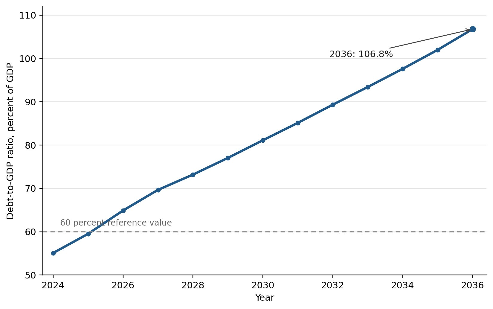
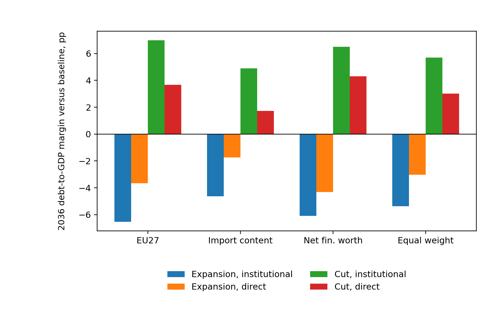

# Abstract

EU fiscal surveillance assesses national budgets through debt projections and net expenditure ceilings, making public investment vulnerable when governments seek adjustment items that can be postponed without immediately reducing transfers, wages, or entitlements. This paper investigates how estimated public investment responses affect the debt consequences of Polish investment policy when fiscal transmission is evaluated through real PPP income, investment import content, public debt, and household balance-sheet fragility. Annual local projections for public investment shocks are estimated in an EU27 panel, after which two Polish evaluations are carried forward: one based on investment import content and one based on household balance-sheet fragility. The estimated responses inform a three year Polish scenario in which public investment is either increased or reduced by one percentage point of GDP annually from 2028 to 2030. By the eighth year, the corresponding cumulative public-investment multipliers are 2.79 for the EU27 benchmark, 2.65 for the Polish investment import-content evaluation, and 2.89 for the Polish household balance-sheet-fragility evaluation. By 2036, the central paradox is that public-investment expansion reduces the debt-to-GDP ratio relative to the Commission baseline, while an equivalent public-investment cut, although intended as consolidation, increases it. In the cut scenario, these endpoint margins are increases in the 2036 debt-to-GDP ratio above the Commission baseline: 4.9 to 6.5 percentage points under the institutional debt equation and 1.7 to 4.3 percentage points under the direct debt-to-GDP local projection path. The institutional equation carries debt forward through the debt recursion applied to the Commission baseline; the direct path evaluates the same signed investment action by applying the local projection estimate of the resulting debt-to-GDP response. Together, these two calculations identify a self defeating mechanism: the discretionary primary-balance gain from cutting investment can be outweighed by persistent output losses, the associated cyclical primary-balance deterioration through automatic stabilisers, and the denominator effect on the debt ratio.

# 1 Introduction
## 1.1 EU fiscal surveillance and debt sustainability analysis

EU fiscal surveillance assesses member states' fiscal plans through legal rules, numerical indicators, medium term adjustment paths, and model based assessments within the Stability and Growth Pact and the European Semester. It provides the institutional setting in which fiscal effort is measured and national budgetary choices are assessed by the European Commission and the Council (Schmidt, 2015; Van der Veer, 2021; European Commission, 2026). The reformed EU fiscal framework gives debt sustainability analysis a more direct role in prior guidance, medium term plan assessment, bilateral exchanges with member states, and corrective paths where fiscal risks are judged to be material (European Commission, 2026; Heimberger et al., 2024).

The institutional importance of the Commission framework follows from its role in surveillance. Structural balances, potential output, output gaps, projected debt paths, interest rate assumptions, growth assumptions, and fiscal multipliers are all model dependent quantities. Once these quantities enter the surveillance model, a change in the estimated output gap can alter the measured structural balance and the assessed fiscal effort without any contemporaneous change in taxes, expenditure, or the headline budget balance. Heimberger, Huber and Kapeller (2020) illustrate this mechanism in the Commission potential output model: assumptions about production functions, trend labour input, and capacity utilisation feed into output gap estimates, which then affect structural deficit calculations and the fiscal space attributed to a member state. Methodological choices therefore shape surveillance assessments because they influence how national plans are evaluated.

The Debt Sustainability Monitor 2025 sets out the medium term projection framework used by the Commission. It combines Commission forecasts with assumptions about potential growth, output gap closure, the structural primary balance, inflation, interest expenditure, ageing related costs, stock flow adjustments, deterministic stress scenarios, and stochastic risk analysis (European Commission, 2026). The empirical application in this paper does not estimate an output gap equation. It estimates real GDP responses directly and treats the Commission output gap closure assumption only as one element of the baseline projection environment being evaluated. Macroeconomic feedback from fiscal measures enters through GDP, the cyclical budget component, the subsequent primary balance path, and the interest-growth term through which existing debt is carried forward. In the reformed framework, these projected paths inform prior guidance, assessment of medium term fiscal structural plans, Council endorsed net expenditure ceilings, annual progress reporting, and the corrective path under the excessive deficit procedure.

The excessive deficit procedure has institutional force because non-compliance can move a member state through Council recommendations, assessments of effective action, revised adjustment paths, closer monitoring, and possible escalation under the corrective arm. For euro area members, the legal framework also provides for deposits or fines; Poland is not in the euro area, so that fine channel is not the immediate sanction mechanism. For Poland, the relevant pressure is therefore the combination of Council endorsed adjustment requirements, annual monitoring, the procedural risk of being found not to have taken effective action, and the legally conditional possibility that macroeconomic conditionality can affect access to cohesion policy funding where the applicable economic governance conditions are met (Sacher, 2019; European Commission, 2026; Council of the European Union, 2024, 2025).

The baseline employed from the Debt Sustainability Monitor originates within the Commission surveillance framework. Local projections treat this baseline as an exogenous reference path without re-estimating it. The path uses the Commission forecast round and assumptions on potential growth, output gap closure, inflation, interest expenditure, ageing costs, stock flow adjustments, structural balances, primary balances, and the debt dynamics equation. Under these assumptions, Poland's general government gross debt ratio increases from 55.1 percent of GDP in 2024 to 106.8 percent in 2036, exceeding the 60 percent Treaty reference value. The same endpoint reflects a structural balance close to -10 percent of GDP and a primary balance near -3.9 percent of GDP. Such a structural deficit is not a plausible domestic policy equilibrium. The series is the Commission's no additional measures surveillance path: in that accounting narrative, debt keeps rising and the fiscal balance remains deeply strained.

These endpoint assumptions warrant methodological caution. Debt sustainability analysis performs accounting work, deriving outcomes from assumptions on growth, interest, inflation, output gap closure, stock flow adjustments, and primary balances. Within EU surveillance, these assumptions can effectively function as policy constraints, influencing prior guidance, assessment of fiscal plans, net expenditure ceilings, annual monitoring, and corrective pathways. Such practices risk circular reasoning: a pessimistic baseline could reinforce arguments for fiscal consolidation, while evaluating that consolidation might suppress public investment, thereby restricting growth feedback on the debt denominator. The scenario results presented below measure margins relative to this Commission surveillance construction. They do not imply that baseline fiscal balances represent a plausible domestic equilibrium. Because the Commission baseline uses the Maastricht general government gross debt concept, later references to that baseline should not be read as applying Poland's national public debt rule unless the text states otherwise (Constitution of the Republic of Poland, 1997; Public Finance Act, 2009; European Commission, 2026). Figure 1 illustrates the Commission baseline debt trajectory before the paper adds any scenario specific percentage point deviations from that baseline.

## 1.2 Critical assumptions in debt projections and consolidation evidence

The institutional significance of these assumptions underscores the necessity of a robust underlying evidence base. The internal consistency of debt projections alone does not resolve related policy considerations. The empirical relationships employed to justify consolidation, debt thresholds, and expenditure cuts must also be sufficiently robust to support their policy functions.

Such reliance on critical assumptions extends beyond the Commission framework. Reinhart and Rogoff (2010) provided influential empirical evidence associating very high public debt with diminished growth. Subsequent studies involving replication and threshold analyses demonstrated considerable sensitivity of their findings to methodological choices such as data processing decisions, weighting schemes, sample composition, functional forms, and the direction of causality between debt and growth. This methodological debate highlights the necessity for caution when interpreting debt ratios as strict constraints on economic growth (Herndon, Ash and Pollin, 2013; Pescatori, Sandri and Simon, 2014; Panizza and Presbitero, 2013; Egert, 2013; Heimberger, 2021).

The debt threshold debate therefore establishes the first caution: causal interpretations drawn from observed correlations between debt and growth are highly sensitive to data handling, functional form, sample composition, and assumptions about reverse causality. Considered together with the expenditure consolidation evidence introduced below, this debate implies a methodological restriction: empirical approaches that aggregate diverse fiscal instruments, rely on crisis driven policy selection, or attribute macroeconomic outcomes to broad fiscal balance indicators cannot establish that reductions in public investment safeguard growth or reduce debt levels. A methodologically rigorous evaluation requires identification of an instrument specific shock, estimation of a dynamic output response, and explicit debt accounting that incorporates these dynamic effects into the debt denominator (Herndon, Ash and Pollin, 2013; Pescatori, Sandri and Simon, 2014; Panizza and Presbitero, 2013; Egert, 2013; Heimberger, 2021).

The same evidentiary issue emerges in the literature on expenditure based consolidation. Alesina, Favero and Giavazzi (2015) construct multi year fiscal plans, classify each plan by its predominant tax or spending component, and interpret subsequent macroeconomic outcomes as evidence regarding the relative output costs associated with these categories. However, for the present analysis, the limitation is the identification object itself: a plan level classification is overly aggregated to isolate the causal effect of a specific fiscal instrument, notably public investment. Related evidence for EU New Member States by Borys, Ciżkowicz and Rzońca (2013) is useful for the Polish context because it shows that the composition of fiscal impulses can affect output components and that expenditure based adjustments may operate through non-Keynesian channels. Its object, however, remains broader fiscal impulses in a New Member State panel rather than a public-investment-specific shock, a public-capital channel, or a debt-to-GDP path for Poland, so it cannot substitute for the instrument-specific debt exercise undertaken here.

The first weakness concerns plan endogeneity. Consolidation plans do not constitute policy shocks; rather, they typically arise under conditions of debt stress, adverse market conditions, sluggish growth, or external constraints, implying that treatment status directly correlates with the macroeconomic environment in which the plan is implemented. Consequently, a plan level coefficient conflates the underlying causes of fiscal adjustment with its observed outcomes. Guajardo, Leigh and Pescatori (2014) explicitly illustrate this issue: substituting the conventional cyclically adjusted primary balance proxy with narratively identified consolidation episodes reverses the central conclusion of the expansionary austerity literature, revealing instead that spending based consolidations are contractionary. Jorda and Taylor (2016) arrive at a similar finding through inverse propensity score weighting of consolidation episodes, demonstrating that the seemingly benign output response attributed to consolidation results primarily from selection bias rather than causal effects. Breuer (2019) underscores a related reverse causality issue for conventional cyclically adjusted methods, showing that correcting for this bias can eliminate or reverse the apparently expansionary effects of fiscal adjustment.

The second weakness is aggregation. Alesina, Favero and Giavazzi's plan level treatment classifies multi year consolidation plans by their predominant tax or expenditure component, which is useful for comparing broad adjustment styles but is not designed to identify the isolated effect of a single spending instrument. For the public investment question, this limitation is material: consolidation episodes can combine current spending restraint, transfers, procurement delays, infrastructure cuts, and implementation revisions even though these instruments differ in timing, persistence, import leakage, and public capital effects. Composition focused consolidation evidence therefore separates public investment from public consumption when evaluating the macroeconomic effects of adjustment episodes, reinforcing the need to measure movements in public investment and the associated dynamic output response directly (Alesina, Favero and Giavazzi, 2015; Breuer, 2019; Ardanaz, Cavallo, Izquierdo and Puig, 2021).

The third weakness concerns persistence of the output response and its feedback into debt dynamics. Blanchard and Leigh (2013) demonstrate that European consolidation episodes systematically produced growth forecast errors consistent with underestimated fiscal multipliers. DeLong and Summers (2012), Fatas and Summers (2018), and Gechert, Horn and Paetz (2019) clarify the economic significance of this result for debt dynamics: if the output contraction proves persistent, the ensuing deterioration of the debt denominator and the endogenous budgetary adjustments may offset any immediate improvement in the primary balance. Cugnasca and Rother (2015) corroborate these findings for the EU consolidation experience, concluding that the realized output responses to fiscal consolidation exceeded those implied by the low multiplier assumptions underlying surveillance frameworks. Carbonari, Farcomeni, Maurici and Trovato (2024) add a related causal reappraisal of consolidation announcements, showing that spending cut announcements can generate negative indirect output effects once mediation channels are accounted for. This reinforces the point that plan labels are not sufficient evidence that expenditure cuts, and especially investment cuts, improve debt outcomes.

For Poland, these methodological implications enter a concrete surveillance setting through distinct EU fiscal surveillance mechanisms. The medium term fiscal structural plan establishes a net expenditure path, with implementation monitored through annual progress reports. Additionally, deficit correction operates through an excessive deficit procedure embedded in a Council adjustment process. Consequently, fiscal surveillance shapes both the pace and composition of Poland's fiscal adjustments. Macroeconomic evaluations for Poland must extend beyond aggregate fiscal indicators to inflation, external balance, balance of payments conditions, domestic fiscal rules, and the investment component of public expenditure. Grodzicki, Mozdzen and Zygmuntowski (2022) reinforce this broader perspective, arguing that numerical fiscal aggregates alone cannot serve as self sufficient policy criteria, and advocating assessments that integrate signals from inflation, the current account, and investment expenditure.

## 1.3 Fiscal multipliers and instrument composition

Public investment forms the instrument specific focus of this paper. Increased public investment stimulates current demand, supports public capital formation, and expands future productive capacity. Consolidation achieved through public investment cuts mechanically improves the primary balance but simultaneously diminishes economic output and the public capital stock. Literature addressing budget composition and fiscal rule design provides further justification for examining public investment distinctly. Investment projects are generally simpler to delay than expenditures such as transfers, wages, or entitlement programmes, and their economic costs are often less apparent at the point of budgetary decision making (Breunig and Busemeyer, 2012; Borge and Hopland, 2015; Pereira and Pinho, 2006; OECD, 2011). In practice, this makes public investment a particularly exposed adjustment item: projects can be postponed, cut back, or reduced through annual allocations. Furthermore, the design of fiscal rules critically determines whether investment spending is protected or curtailed during fiscal adjustment episodes (Ardanaz et al., 2020). Therefore, the key analytical concern becomes how debt projections respond when public investment expansion and public investment consolidation incorporate estimated growth feedbacks, rather than relying solely on a single short run multiplier applied directly to the structural primary balance.

The Commission's Debt Sustainability Monitor 2025 uses a common fiscal multiplier of 0.6 in the relevant fiscal policy scenarios. A 1 percentage point improvement in the structural primary balance reduces actual GDP growth by 0.6 percentage points in the same year, while potential growth is assumed to remain unchanged (European Commission, 2026). The multiplier affects the debt ratio in two ways: lower GDP raises the debt-to-GDP ratio mechanically by reducing the denominator, and weaker activity changes the cyclical component of the budget balance, which then feeds into the primary balance path. The Debt Sustainability Monitor framework also relies on a specified output gap closure rule. The Commission notes that multipliers vary with structural characteristics, cyclical conditions, monetary policy settings, policy instruments, and the composition of adjustment, and it allows member states to justify different values in their own plans. The operational simplification nevertheless remains a common value used for prior guidance across countries.

This instrument specific question requires more than a common multiplier. Public investment, public consumption, transfers, and taxes have different dynamic effects. Multipliers vary by openness, exchange rate regime, public capital stock, fiscal position, monetary accommodation, and horizon (Ilzetzki, Mendoza and Vegh, 2013; Ramey and Zubairy, 2018; Cloyne, Jorda and Taylor, 2023). Evidence for Poland and for cross country samples already documents this heterogeneity.

Table 1. Polish multiplier evidence used to motivate instrument specific estimation.

| Source | Fiscal measure | Reported multiplier values |
|---|---|---|
| Ministry of Finance of Poland, Medium Term Fiscal Structural Plan 2025-2028 | NEMPF effective consolidation multiplier and one year category multipliers | Effective consolidation multiplier: 0.449 in 2026, 0.498 in 2027, 0.528 in 2028; one year category multipliers: total expenditure 0.788, public investment 1.493. |
| Haug, Jedrzejowicz and Sznajderska (2019) | Government spending in Poland | Impact 0.70; four quarters 1.13; eight quarters 1.46; peak 1.61 after fourteen quarters. |
| Sznajderska (2025) | Fiscal policy shocks in Poland | Impact spending multiplier 1.25; long run cumulative spending multiplier 1.04; impact tax multiplier -1.18. |
| Haug, Lyziak and Sznajderska (2025) | Local projection IV government spending in Poland | Peak cumulative linear multiplier 1.53 after six quarters; pre-Covid peak 1.38 after eight quarters. |

Note: The negative tax multiplier follows the standard sign convention for a positive tax shock: higher taxes reduce output.

Table 2. Cross country and European multiplier evidence used to motivate instrument specific estimation.

| Source | Fiscal measure or conditioning dimension | Reported multiplier values |
|---|---|---|
| Ilzetzki, Mendoza and Vegh (2013) | Government consumption, high income countries | Impact 0.39; long run 0.66. |
| Ilzetzki, Mendoza and Vegh (2013) | Openness and exchange rate regime | Closed economies: impact 0.61, long run 1.10; open economies: impact -0.077, long run -0.46; fixed exchange rates: long run about 1.4; flexible exchange rates: long run about -0.69. |
| Ilzetzki, Mendoza and Vegh (2013) | Pure government investment shocks | High income countries: impact 0.39, long run 1.5; developing countries: impact 0.57, long run 1.6. |
| IMF Working Paper 2019/289 | Public investment and initial public capital stock | Public investment: impact 0.15, two years 0.80; low initial public capital: two years 2.15; high initial public capital: two years 0.15. |
| Ciaffi, Deleidi and Capriati (2024) | Government spending in OECD countries; linear and high public debt states | Linear model: impact 0.72, five year 0.87; high debt cases: impact 0.64 to 0.80, five year 1.51 to 1.56. |
| Gechert and Will (2012) | Meta regression by fiscal instrument | Reported means: general public spending 1.0; public investment 1.2; transfers 0.4; taxes 0.6. |
| Saccone (2022) | Public investment in European countries | Total public investment: 0.979 on impact and 2.056 at horizon 6; economic affairs investment: 0.859 on impact and 2.336 at horizon 6. |

The tables show that Polish official planning and the wider multiplier literature already distinguish fiscal instruments and report values that vary by horizon, instrument, and conditioning environment. The reported public investment evidence motivates estimating that instrument separately and carrying its output path into the debt assessment.

The paper is organised as follows. Section 2 presents the data, fiscal shock construction, and local projection methodology. Section 3 reports the estimated response trajectories. Section 4 applies them to public investment expansion and consolidation scenarios for Poland. Section 5 concludes.

# 2 Data and empirical strategy
## 2.1 Local projection framework

Local projections estimate dynamic responses by running a separate regression for each horizon after a policy intervention or shock. The outcome dated $t+h$ is regressed on the shock dated $t$, conditional on controls, so the sequence of horizon-specific coefficients gives the impulse response. This approach follows Jorda (2005) and the subsequent local projection literature, which emphasises direct estimation of impulse responses without imposing the full dynamic restrictions of a vector autoregression (Jorda and Taylor, 2024). It is well suited to fiscal multiplier analysis because multiplier estimates depend on the shock definition, the fiscal instrument, the horizon, and the conditioning information set (Ramey and Zubairy, 2018; Ramey, 2019).

The public investment shock is identified before the local projection regressions are estimated because a movement in public investment is not automatically a policy shock. Public investment growth may reflect current activity, common funding cycles, interest rate conditions, project completion, or planned procurement rather than an exogenous fiscal impulse. The recursive system therefore isolates the unexplained public investment movement under a timing restriction, and the local projections then estimate how that identified innovation propagates across horizons. This separation between shock identification and response estimation follows the fiscal shock literature: Blanchard and Perotti (2002) identify fiscal shocks before tracing their macroeconomic effects; Jorda (2005) estimates horizon responses directly once the treatment variable is defined; Ramey (2019) and Ramey and Zubairy (2018) stress that multiplier estimates depend on the shock measure; and Ciaffi, Deleidi and Di Domenico (2024) first identify public investment shocks and then insert them into local projections. The present paper uses the same separation for an annual EU27 panel and for Polish state evaluation.

The first step estimates a system containing public investment growth, public consumption growth, output growth, and the short term interest rate. Public investment is ordered first in the recursive timing structure, following the fiscal shock literature that treats public investment as relatively predetermined within the year because large investment decisions are shaped by multiannual political, administrative, and procurement processes (Ciaffi, Deleidi and Di Domenico, 2024; Ciaffi, Deleidi and Mazzucato, 2024). Under this timing restriction, output, public consumption, and the interest rate may respond within the same year to the public investment movement, while public investment does not respond contemporaneously to those variables. The remaining unexplained movement in public investment growth is then used as the public investment shock in the local projections.

The analysis uses an annual EU27 panel for 2004-2024, beginning with the first year of Poland's EU membership. A Poland only annual regression would provide too few observations since 2004 to estimate controlled dynamic responses through the eighth year and too little variation to assess how fiscal transmission changes with country characteristics. The EU27 panel provides variation across countries and time while keeping the estimation within the institutional setting relevant for Poland's fiscal surveillance. Country fixed effects absorb persistent cross country differences, and year fixed effects absorb common yearly disturbances. The linear EU27 specification estimates a common public investment response conditional on fixed effects and lagged controls. Poland is evaluated later through interactions between the public investment shock and Poland's observed state values.

For each horizon $h\in\{0,\ldots,8\}$, the baseline linear local projection is

$$
y_{i,t+h}=\alpha_i^h+\tau_t^h+\beta_h s^{GI}_{i,t}
+\gamma_h s^{GC}_{i,t}+\Gamma_h' W_{i,t-1}+u^h_{i,t+h}.
$$

Here $i$ indexes EU27 member states and $t$ indexes years. The dependent variable $y_{i,t+h}$ is the scaled outcome at horizon $h$, defined as real GDP in output regressions and public investment spending in spending regressions. The term $s^{GI}_{i,t}$ is the identified public investment shock, and $s^{GC}_{i,t}$ is the identified public consumption shock included as a fiscal control. The lagged controls are chosen to match the fiscal, output, and monetary variables used in the recursive shock-identification system, following the practice of conditioning local projections on pre shock dynamics in the relevant information set (Jorda, 2005; Ciaffi, Deleidi and Di Domenico, 2024). The vector $W_{i,t-1}$ contains lagged public investment growth, lagged public consumption growth, lagged output growth, and the lagged short term interest rate. The terms $\alpha_i^h$ and $\tau_t^h$ denote country and year fixed effects. The coefficient $\beta_h$ is therefore the common linear EU27 response to the public investment shock at horizon $h$, conditional on fixed effects, the public consumption shock, and lagged controls.

The linear specification imposes the same marginal response across the panel after these controls. To evaluate how the response changes with country characteristics, the paper also estimates state dependent local projections. The approach follows the interaction logic in Cloyne, Jorda and Taylor (2023), where the effect of a policy intervention can vary with observed information from before the shock year. It is also consistent with the fiscal multiplier literature in which responses vary with macroeconomic conditions and policy settings (Ramey and Zubairy, 2018). In this paper, the state variables are continuous predetermined characteristics rather than binary recession expansion indicators.

The state dependent specification is

$$
y_{i,t+h}=\alpha_i^h+\tau_t^h+\beta_h s^{GI}_{i,t}
+\theta_h'(s^{GI}_{i,t}\otimes z_{i,t-1})+\delta_h' z_{i,t-1}
+\gamma_h s^{GC}_{i,t}+\Gamma_h' W_{i,t-1}+u^h_{i,t+h}.
$$

The vector $z_{i,t-1}$ contains lagged state variables. Because these variables are standardised, the coefficient $\beta_h$ gives the public investment response for a country at the sample mean of the state variables. The vector $\theta_h$ shows how the response changes when a country's state values differ from that mean. The vector $\delta_h$ allows the same variables to enter the outcome equation directly, separately from their interaction with the public investment shock. The public consumption shock, lagged controls, and fixed effects are the same as in the linear specification. The evaluation for Poland is obtained by applying Poland's observed standardised state values to the estimated interaction structure. Poland's evaluated response is therefore generated within the state dependent fixed effects local projection by the mean state coefficient $\beta_h$ together with the interaction term $\theta_h' z_{PL,t-1}$.

In summary, the identified shocks are then used as regressors in horizon-specific local projections. This shock-identification-plus-local projection structure follows Ciaffi, Deleidi and Di Domenico (2024), and the present paper adapts it to an EU27 annual panel and to Polish state variable evaluation.

The state variables used in the interaction terms are lagged and standardised on the EU27 panel, as defined in Section 2.2. Appendix A reports the state variable definitions and the eighth year output interaction selection rule used for the Polish evaluations.

Several limitations follow from this design. Local projections are flexible and transparent, but the exogenous variation comes from the recursively identified fiscal shocks and therefore depends on the maintained timing restriction; local projections may also deliver less smooth or less efficient response estimates than a correctly specified dynamic system (Jorda, 2005; Jorda and Taylor, 2024). State dependent local projections require caution when conditioning variables evolve endogenously, when relevant interactions are omitted, or when the evaluated shock lies outside the support of historical experience (Cloyne, Jorda and Taylor, 2023; Goncalves, Herrera, Kilian and Pesavento, 2023). The estimates should therefore be read as conditional dynamic responses to identified fiscal shocks within the observed EU27 panel.

## 2.2 State variables

This section defines the country characteristics that condition the propagation of fiscal shocks within the EU27 panel. The four structural state variables examined are investment import content, public debt, household balance-sheet fragility, and real PPP income level. Each state variable is explicitly defined prior to estimation, linked to a specific economic mechanism, and consistently measured using harmonised data from cross country sources (Ilzetzki, Mendoza and Vegh, 2013; Huidrom, Kose, Lim and Ohnsorge, 2019; Kaplan, Violante and Weidner, 2014; Cloyne, Jorda and Taylor, 2023).

In the regression framework, a state variable represents a predetermined country characteristic that interacts with fiscal shocks, summarising the context in which fiscal transmission takes place. It is recorded before the year in which the shock occurs and does not feature in the response trajectory following the shock. This methodological distinction follows Cloyne, Jorda and Taylor's (2023) separation between treatment, conditioning state, and dynamic propagation. It also aligns with fiscal position research that considers initial fiscal conditions as possible determinants of multiplier strength rather than outcomes of fiscal policies (Huidrom, Kose, Lim and Ohnsorge, 2019). Investment import content data is sourced from the OECD TiVA database released in 2025. Official measurements of domestic value added shares in gross fixed capital formation extend through 2022 in the source used here, so the common TiVA state window is 2004 to 2022.

The operational definitions undergo standardisation before Section 2.3 evaluates subsets of the candidate universe. Table 2a provides details on each variable's measurement, standardisation moments, observation count, and Poland's value before and after standardisation. The TiVA common window is 2004-2022. Public debt measurements rely on Eurostat debt observations available in the annual debt panel.

\TableBlock

Table 2a. State-variable measurement and Polish profile, Panel A: definitions.

| State variable | Definition | n |
|---|---|---:|
| Investment import content | Import content of gross fixed capital formation, measured from OECD TiVA domestic value added shares | 513 |
| Public debt | Maastricht gross debt, percent of GDP | 567 |
| Household balance-sheet fragility | Negative of household net financial worth divided by nominal GDP; higher values indicate weaker household net financial worth | 513 |
| Real PPP income level | Log real GDP per capita in 2020 PPS terms | 513 |

\CompactTableBlock

Table 2a continued. State-variable measurement and Polish profile, Panel B: standardisation and Poland values.

| State variable | EU27 mean | EU27 sd | Poland value | Poland standardised value |
|---|---:|---:|---:|---:|
| Investment import content | 0.429 | 0.101 | 0.413 | -0.161 |
| Public debt | 62.5 | 36.5 | 48.8 | -0.377 |
| Household balance-sheet fragility | -1.112 | 0.592 | -0.657 | 0.769 |
| Real PPP income level | 10.210 | 0.384 | 10.184 | -0.068 |

Investment import content is incorporated because the domestic output response to investment demand depends on the proportion of expenditures met by domestic value added rather than imported content. The measure is derived from the OECD TiVA domestic value added share of gross fixed capital formation, with import content calculated as one minus the domestic value added share. Thus, a higher value indicates greater leakage of investment demand into imports rather than into domestic value added. This state directly relates to the investment channel analysed in the paper and to the openness mechanism in the fiscal multiplier literature (Ilzetzki, Mendoza and Vegh, 2013; Cacciatore and Traum, 2020).

Public debt features as a fiscal position state. Within the multiplier literature, initial fiscal positions influence fiscal transmission through channels such as sovereign risk premia, economy wide borrowing costs, exchange rate dynamics, and constraints from fiscal rules. Ilzetzki, Mendoza and Vegh (2013) identify public indebtedness as a country characteristic relevant for fiscal multiplier heterogeneity, while Huidrom, Kose, Lim and Ohnsorge (2019) link fiscal positions to interest rate and risk premium channels. Debt therefore appears in two distinct roles. In Section 2, the public debt ratio acts as a pre shock fiscal position characteristic conditioning the estimated output response. In Section 4, the future debt-to-GDP path is the outcome generated by the scenario analysis.

Public debt is measured as Maastricht general government gross debt relative to GDP. The paper employs the Maastricht debt ratio as a pre shock fiscal position state. This conditioning state influences fiscal transmission through risk premia, interest rate and growth dynamics, exchange rate conditions, domestic and EU fiscal rule assessments, and the composition of fiscal adjustment (Blanchard, 2019; Grodzicki, Mozdzen and Zygmuntowski, 2022; Ministry of Finance of Poland, 2024; European Commission, 2026; Huidrom, Kose, Lim and Ohnsorge, 2019). Section 1.1 distinguishes the EU Maastricht measure from Polish national public debt rules. Within this section, public debt enters only as a pre shock conditioning variable.

Household balance-sheet fragility is measured from financial accounts data as the negative of household financial assets net of liabilities relative to GDP. Non-financial assets, including housing, are excluded from the numerator, and the measure is transformed so that higher values indicate weaker household net financial worth relative to GDP. This variable characterizes the household financial resilience state, as fiscal shocks may propagate differently when households possess limited net financial capacity to smooth consumption following income fluctuations. Kaplan, Violante and Weidner (2014) provide the microeconomic distinction between liquid resources and illiquid wealth that motivates treating household balance sheets as relevant for consumption smoothing. Bernardini, De Schryder and Peersman (2017) show that household leverage conditions the transmission of fiscal shocks through balance sheet positions. Krajewski and Pilat (2025) provide the Polish household finance context in which liquidity constraints and financial buffers are empirically relevant. The paper's EU27 measure is therefore a comparable macro financial accounts state, not a direct household survey measure of liquid deposits.

Real PPP income level is defined as the logarithm of real GDP per capita, expressed in 2020 purchasing power standard terms. Its economic role is to capture heterogeneity in development levels, reflecting variations in fiscal transmission across economies characterized by differing income levels, market structures, relative price environments, and broader macroeconomic conditions. Ilzetzki, Mendoza and Vegh (2013) explicitly explore multiplier differences between high income and developing economies, while Huidrom, Kose, Lim and Ohnsorge (2019) similarly link multiplier variability to structural factors and macro financial conditions.

The analysis is confined to these four variables because multidimensional state dependence introduces challenges related to conceptual clarity and empirical rigor. Cloyne, Jorda and Taylor (2023) demonstrate that reliance on a single dimension of state dependence may obscure the complexity arising from interactions among multiple state variables, yet their methodological framework underscores the necessity of maintaining an interpretable state space distinct from results based model selection. Similarly, Ilzetzki, Mendoza and Vegh (2013) emphasize identifying heterogeneity through clearly defined country characteristics rather than unrestricted exploration across all possible conditioning variables. The selected candidate universe thus prioritizes variables with explicit economic interpretations (investment import content, public debt, household balance-sheet fragility, and real PPP income level) prior to applying the candidate selection rule.

Unemployment and the output gap belong to the cyclical state-dependence literature rather than to the slower moving structural conditioning variables used here. Auerbach and Gorodnichenko (2012, 2013) and Ramey and Zubairy (2018) investigate fiscal multiplier differences between slack and expansion states, informing a distinct cyclical approach to state dependent fiscal transmission. This study instead emphasizes slower moving structural heterogeneity across EU27 economies. This narrower scope additionally mitigates an endogeneity concern highlighted in the state dependent local projection literature: unemployment and the output gap represent contemporaneous measures of cyclical conditions and can move simultaneously with fiscal shocks and output responses (Cloyne, Jorda and Taylor, 2023). Consequently, the empirical analysis here focuses exclusively on structural conditioning variables, whereas recession expansion asymmetries remain a separate analytical design.

Section 2.2 therefore establishes the candidate universe of state variables. The analysis then evaluates non-empty combinations of the four variables under criteria fixed before the response analysis. The four variable set remains fixed, preserving the distinction between structural state definition, subset selection, and multiplier interpretation emphasized by Cloyne, Jorda and Taylor (2023).

## 2.3 Candidate specification selection and diagnostics

Section 2.2 limited the conditioning universe to four state variables: investment import content, public debt, household balance-sheet fragility, and real PPP income level. These four variables imply fifteen non-empty candidate subsets. The subsets are evaluated before the response analysis reported in Section 3. The carried forward set is determined by one criterion: the Wald test for the interaction between the public investment shock and the included state variables in the eighth year output equation. Numerical estimability, empirical support for Poland's state profile, and stability under changes to the country and time composition of the panel are reported as descriptive diagnostics for the full candidate universe.

The design reflects a tension in state dependent local projections. Omitting relevant state dimensions can confound the interpretation of interaction terms, while adding interactions can weaken support, produce unstable estimates, or place excessive weight on a small number of country observations (Cloyne, Jorda and Taylor, 2023). The pre response documentation therefore separates selection from diagnostics. The largest candidate receives no preference by construction, and Appendix A keeps every candidate visible.

The numerical diagnostics document the realized rank of the local projection regressor matrix at the diagnostic horizon, the condition number, and the maximum absolute correlation among included state variables. Rank deficiency would remove unique identification for the regression coefficients of interest in the diagnostic horizon. Elevated condition numbers or substantial collinearity among state variables indicate that minor perturbations in data could substantially alter interaction estimates. These diagnostics align with established regression diagnostic principles that emphasise sensitivity to leverage, ill conditioning, and influential data subsets (Welsch and Kuh, 1977).

Support diagnostics describe the empirical location of Poland's evaluated state values within the EU27 panel. The reported values are Poland's maximum absolute standardised state value and the support p value for the candidate subset. The principle is that conditional inference becomes fragile when the target lies in a poorly represented part of the covariate distribution (Crump, Hotz, Imbens and Mitnik, 2009; Li, Morgan and Zaslavsky, 2018). The support diagnostics therefore describe the distance between Poland's evaluated state profile and the observed country distribution. A high support p value is not a failure of the carried forward criterion; it means that Poland's state profile is not located far from the observed EU27 support. By contrast, a high output-interaction p value close to one means that the included interaction terms do not reject joint irrelevance in the eighth year output equation; these candidates remain disclosed in the diagnostic tables but are not carried forward into the response-path and debt applications.

The output interaction diagnostic supplies the selection criterion. It asks whether the interaction terms between the public investment shock and the included state variables are jointly relevant in the output equation. The test is implemented at horizon $h=8$, the terminal horizon used for the reported output response paths and the later debt application. The carried forward set contains candidates for which the Wald test rejects joint irrelevance at the conventional $p < 0.05$ threshold.

Stability diagnostics account for the panel structure underlying the design. Clustered panel inference addresses within country correlation, since residuals for the same country may be correlated over time even when residuals are treated as independent across countries (Cameron and Miller, 2015). With a limited number of heterogeneous country clusters, a candidate specification may be driven by particular countries or by a narrow time segment, even when the full sample regression is estimable (MacKinnon, Nielsen and Webb, 2023). The leave one country out, bootstrap, and time block diagnostics therefore record whether the candidate can be re-estimated with well defined coefficients after plausible changes to the country or time composition of the panel. These values are reported for the record before the standard errors for the response paths are interpreted.

The two state dependent Polish evaluations carried forward to the results are the single state candidates whose eighth year output interaction p values fall below 0.05. Table 2b reports the reader facing selection result. Appendix A reports the full numerical diagnostics, empirical support values, output interaction tests, and stability values for all fifteen candidate subsets.

\TableBlock

Table 2b. Polish evaluations carried forward by the eighth year output interaction criterion.

| Polish evaluation carried forward | State variable | Eighth year output interaction p value | Polish state value |
|---|---|---:|---:|
| Investment import content evaluation | Investment import content | 0.004 | -0.161 |
| Household balance-sheet-fragility evaluation | Household balance-sheet fragility | 0.013 | 0.769 |

Notes: In the investment import content evaluation, Poland is slightly below the EU27 mean import content value for gross fixed capital formation, and the interaction is statistically relevant for the eighth year output response. In the household balance-sheet-fragility evaluation, Poland is above the EU27 mean of the transformed household balance sheet state, meaning weaker net financial worth relative to GDP under the paper's sign convention; this interaction is also statistically relevant for the eighth year output response.

Appendix A reports the state variable definitions and the full fifteen subset disclosure. Real PPP income level belongs to the conditioning universe, but its interactions remain outside the carried forward set because each output interaction p value involving that state is at least 0.05. The single variable real PPP income subset has $p=0.463$, and the larger income combinations likewise remain outside the carried forward set. The combined investment import content, public debt, and household balance-sheet fragility subset has $p=0.957$ and is also outside the carried forward set. Section 3 therefore reports empirical response paths for the linear EU27 benchmark and for the two Polish evaluations shown above. Appendix D reports the coefficient-level estimation output behind these paths, including horizon-specific shock coefficients, interaction coefficients, standard errors, p values, observation counts, country counts, year ranges, fixed effects, covariance estimator, and design matrix rank. These diagnostics characterize coefficient-level precision and are distinct from both the pre-specified retention rule and any full-path confidence interval for the debt translation.

# 3 Results

## 3.1 EU27 panel benchmark and Polish evaluations within the EU27 panel

The results first report cumulative output responses for public investment, because the debt application in Section 4 uses the estimated output paths as inputs.

For each horizon $h$, $K_Y(h)$ denotes the cumulative real GDP response through horizon $h$ to the identified public investment shock. The corresponding $K_G(h)$ is the cumulative movement in public investment spending generated by the same shock. The scenario in Section 4 is stated as a policy action of one percentage point of GDP in each of three years, while the empirical model estimates the output and spending paths generated by the identified public investment innovation. $K_G(h)$ links the estimated shock scale to the stated fiscal action; $K_Y(h)$ carries the output feedback into the debt calculation. The two objects differ because public investment spending is itself dynamic after the identified shock: spending can rise on impact and then partly unwind, while output can persist through demand, capacity, and balance sheet channels. The ratio $K_Y(h)/K_G(h)$ is therefore the cumulative output response per cumulative unit of public investment spending, which is the multiplier concept most closely related to the fiscal multiplier literature (Ilzetzki, Mendoza and Vegh, 2013; Ramey and Zubairy, 2018; Ciaffi, Deleidi and Di Domenico, 2024). This ratio is the relevant comparison object for a multiplier such as the Commission's 0.6, although the comparison remains only orienting because the Commission value is a one year GDP growth response to a structural primary balance change, while $K_Y(h)/K_G(h)$ is an eighth year cumulative investment spending ratio. Table 3 reports $K_Y(h)$, $K_G(h)$, and $K_Y(h)/K_G(h)$ through the eighth annual horizon for the EU27 panel benchmark, the two Polish evaluations selected by the eighth year output interaction criterion, and their equal weight arithmetic average.

\TableBlock

Table 3. Eighth year cumulative output and spending responses for public investment.

| Path | Evaluation basis | $K_Y(8)$ | $K_G(8)$ | $K_Y(8)/K_G(8)$ | Role |
|---|---|---:|---:|---:|---|
| EU27 benchmark | Fixed effects panel, no state interactions | 2.11 | 0.76 | 2.79 | EU27 reference |
| Investment import content | Poland's TiVA investment import content profile | 1.84 | 0.69 | 2.65 | Import leakage evaluation |
| Household balance-sheet fragility | Poland's financial accounts balance sheet profile | 2.16 | 0.75 | 2.89 | Household balance sheet evaluation |
| Equal weight average | Arithmetic average of the two retained Polish paths | 2.00 | 0.72 | 2.78 | Section 4 summary path |

Notes: The output and spending responses are cumulative response units under the public investment shock normalization. Positive output values mean output above the no shock path. The ratio divides the eighth year cumulative output response by the eighth year cumulative spending response. Rounded ratios correspond to Appendix B, Table B.3.

The EU27 panel benchmark gives an eighth year cumulative output response of 2.11. This estimate is the response for the panel average conditional on country and year fixed effects and the lagged controls in the linear specification. Because the linear specification imposes a common slope on the public investment shock, the estimate serves as the EU27 benchmark rather than as a Poland specific response.

The investment import content Polish evaluation gives an eighth year cumulative output response of 1.84. Poland's evaluated import content value is close to, and slightly below, the EU27 panel mean: the raw Polish value is 0.413, compared with an EU27 mean of 0.429, giving a standardised value of -0.161. There is no sign reversal in the data construction: the source variable is the OECD TiVA domestic value added share of gross fixed capital formation, and the paper's import content state is one minus that share. Nor is the comparison with the EU27 benchmark a mechanical one variable comparison. Within the investment import content specification itself, Poland's below mean state value raises the eighth year output response relative to the same state dependent specification evaluated at the EU27 mean. The EU27 benchmark, however, is a different linear panel response without state interactions. The Polish investment import content path is above the EU27 benchmark in the first horizons but below it from the third horizon onward, so the 2036 debt endpoint remains less self defeating than the EU27 benchmark while still self defeating under a cut. This pattern is consistent with the trade multiplier literature, which treats import leakage as composition dependent rather than as a monotone openness rule: fiscal transmission depends on the domestic value added content of demand, the relative import content of public and private expenditure, production structure, financing, and invoicing conditions (Ilzetzki, Mendoza and Vegh, 2013; Cacciatore and Traum, 2020; Crespo Cuaresma and Glocker, 2023).

The household balance-sheet-fragility Polish evaluation gives an eighth year cumulative output response of 2.16. In this specification, Poland is evaluated through the household sector's net financial balance sheet position rather than through a direct credit flow measure. The state therefore captures a financial accounts balance sheet channel: the transmission of fiscal shocks can differ when household financial assets net of liabilities are weaker relative to GDP (Kaplan, Violante and Weidner, 2014; Bernardini, De Schryder and Peersman, 2017).

The equal weight average across the two retained Polish evaluations is 2.00 in the eighth year. It reports the midpoint of the investment import content and household balance-sheet paths used in the debt application.

## 3.2 Persistence and shape of the output responses across horizons

Section 3.1 reported eighth year cumulative output responses for the EU27 panel benchmark, the two retained Polish evaluations, and their equal weight average. These values are endpoints of a sequence of cumulative response paths. This subsection follows $K_Y(h)$, the cumulative output response at horizon $h$, from impact through the eighth year.

Figure 2 plots the full sequence. At each horizon, $K_Y(h)$ is the cumulative real GDP response under the paper's public investment shock normalization. The figure includes the EU27 benchmark, the two retained Polish evaluations, and the equal weight Polish average.

The estimated paths remain positive throughout the reported horizon. They rise strongly in the first two years, moderate in the middle horizons, and then rise again by the eighth year. The sign is important for the scenario application: for an equal public investment cut, the same response paths imply a persistent output loss rather than a transitory impact effect. The investment import content Polish evaluation reaches 1.84 in the eighth year. The household balance-sheet-fragility evaluation reaches 2.16. Their equal weight average is close to the EU27 benchmark at the final horizon, while still preserving the distinction between the import leakage and household balance sheet evaluations.

Table 4 reports selected horizons from the same paths, and Appendix B reports the full values at each horizon.

\CompactTableBlock

Table 4. Selected values of $K_Y(h)$.

| Empirical path | $h=0$ | $h=2$ | $h=5$ | $h=8$ |
|---|---:|---:|---:|---:|
| EU27 panel benchmark | 1.14 | 2.20 | 1.71 | 2.11 |
| Polish evaluation based on investment import content | 1.39 | 2.30 | 1.22 | 1.84 |
| Polish evaluation based on household balance-sheet fragility | 1.19 | 2.46 | 1.61 | 2.16 |
| Equal weight average across the two Polish evaluated paths | 1.29 | 2.38 | 1.42 | 2.00 |

The selected horizons show that the EU27 benchmark and the equal weight Polish average remain close in the eighth year, while the two Polish evaluations differ modestly at the final horizon. In the eighth year, the investment import content response is 1.84 and the household balance-sheet-fragility response is 2.16. The average therefore summarizes the two retained Polish evaluations but does not remove the difference between the import leakage and household balance sheet channels.

The main implication is persistence over the observed local projection horizon. The estimated response extends beyond the impact year: cumulative output responses remain positive through the eighth year, and the later values are still economically material. For an expansion, persistence raises output during the years in which the debt ratio is assessed. For an equal cut, reversing the sign of the public investment action turns the same response path into a sustained output shortfall. The hysteresis literature gives the economic reason this persistence cannot be treated as cosmetic: demand shortfalls can reduce investment, weaken labour market attachment, and lower future productive capacity (DeLong and Summers, 2012; Fatas and Summers, 2018; Engler and Tervala, 2016; Gechert, Horn and Paetz, 2019).

# 4 Application to Polish public investment scenarios

## 4.1 Scenario design

Polish public investment is situated at the intersection of national development planning, EU fiscal surveillance, and discretionary political decisions regarding project implementation. Poland's medium term fiscal structural plan is structured around a defined net expenditure path extending to 2028. Official Polish documents indicate that Poland has been under the excessive deficit procedure since July 2024. The evaluation process under this procedure focuses on adherence to the recommended expenditure path and tracks the progress of reforms and investments tied explicitly to EU priorities (Ministry of Finance of Poland, 2024, 2025; European Commission, 2026). The institutional challenge arises both from the overall size of the fiscal balance and from the composition of budgetary adjustments, particularly when multiannual investment commitments must extend across multiple budget cycles under a surveillance framework that closely examines expenditure growth and debt trajectory forecasts.

Centralny Port Komunikacyjny shows how an investment programme that remains active in official planning can undergo substantive revisions to its timeline, total funding envelope, and annual State Treasury engagement. The active programme covering 2024-2032 sets commitments for airport development, high speed rail, and road infrastructure, with an official envelope of PLN 131.7 billion, and schedules the first stage of the airport and the Warsaw-CPK-Lodz high speed connection for completion by the end of 2032. Compared with the previous programme for 2024-2030, adopted in 2023, the revised plan reduces the headline envelope from PLN 155.1 billion, decreases the State Treasury engagement limit from PLN 66.2 billion to PLN 62.9 billion, extends the timeline by two years, and lowers the maximum annual State Treasury bond engagement from over PLN 13 billion to approximately PLN 11.5 billion. Official programme materials therefore show a continuing programme with documented changes in schedule, total envelope, and annual Treasury bond engagement (Council of Ministers of Poland, 2023, 2024b; Centralny Port Komunikacyjny, 2025).

The Polish Nuclear Power Programme similarly illustrates continuity alongside delay and phased preparatory work. The 2025 programme update maintains the original objective of constructing two nuclear power plants with an aggregate capacity of approximately 6 to 9 GWe, but shifts the timetable for the first plant: the 2020 programme had scheduled the first unit to begin operation in 2033, while the updated 2025 version targets commercial operation of the first reactor for 2036, with subsequent units planned for 2037 and 2038. Resolution No. 66 of 24 June 2024 also modified Appendix 3 of the programme, which concerns implementation expenditure. The 2025 update designates the second plant for a staged preparatory phase, covering location assessment, technology and contractor selection, business model design, financing arrangements, and ownership structure. Site assessments concentrate on coal-region candidates, specifically identifying Bełchatów, Konin, Kozienice, and Połaniec for detailed examination, with a preference indicated for Bełchatów and Konin. At the same time, the earlier PGE-ZE PAK-KHNP Pątnów route has changed. The 2022 official materials described cooperation among PGE, ZE PAK and KHNP for Pątnów; later reports indicated KHNP's withdrawal from, or closure of, its Polish nuclear route, while 2025 official material presents the second-plant process as a PGE-led preparatory phase in which Konin remains among the preferred or analysed locations (Ministry of State Assets of Poland, 2022; Yonhap News Agency, 2025; Pulse, 2025; Ministry of Energy of Poland, 2025). This evolution does not show that Konin was abandoned as a candidate location. It shows, at minimum, delay in the investment decision and regression from a named implementation route to renewed preparation: location assessment, technology and contractor selection, ownership and financing design, and preparatory work. More generally, renewed preparatory analysis can slow the real investment path even when the stated programme objective remains in force. The programme therefore provides a second example of a continuing investment commitment whose real annual expenditure profile can shift through delays, staging, and preparatory work (Polish Nuclear Power Programme, 2020; Council of Ministers of Poland, 2024a; Ministry of Industry of Poland, 2025; Ministry of State Assets of Poland, 2022; Ministry of Energy of Poland, 2025).

Fiscal policy is evaluated here as a path rather than as a sequence of independent annual shocks. Three aspects of the literature support this perspective. First, cumulative and present value multipliers compare output responses with spending responses over a horizon, rather than only an impact coefficient (Ilzetzki, Mendoza and Vegh, 2013; Ramey and Zubairy, 2018; Ramey, 2019; Huidrom, Kose, Lim and Ohnsorge, 2019; Saccone, 2022). Second, fiscal plans are normally implemented over time, so their effects on budgets and GDP should be evaluated as paths rather than as isolated one year events (Alesina, Favero and Giavazzi, 2015; Ramey, 2019). Third, debt outcomes depend on the interaction between spending, output, the primary balance, and the debt-to-GDP denominator (Fatas and Summers, 2018; Ciaffi, Deleidi and Di Domenico, 2024). The specific policy translation used below is this paper's scenario implementation: three annual public investment actions of one percentage point of GDP in 2028, 2029, and 2030, combined with the estimated spending and output response paths.

Let $\sigma=1$ denote the expansion case and $\sigma=-1$ denote the cut case. The programmed annual action vector is

$$
a_s =
\begin{cases}
\sigma, & s=0,1,2,\\
0, & s \geq 3,
\end{cases}
$$

where $s=0,1,2$ correspond to 2028, 2029, and 2030. A single 2028 action alone generates the spending path $P_G^{(1)}(h)=\sigma K_G(h)$ and the output path $P_Y^{(1)}(h)=\sigma K_Y(h)$. The three year programme adds the delayed responses from the three programmed actions:

$$
P_G^{(3)}(h)=\sum_{s=0}^{\min(h,2)} a_s K_G(h-s),
\qquad
P_Y^{(3)}(h)=\sum_{s=0}^{\min(h,2)} a_s K_Y(h-s).
$$

Thus, the 2031 spending effect is $a_0K_G(3)+a_1K_G(2)+a_2K_G(1)$, with $a_3=0$. The nonzero value after 2030 is therefore not a fourth annual fiscal action; it is the continuing dynamic response to the three actions already introduced. The one percentage point figure is the annual policy scale within a multiannual investment framework, not the complete dynamic spending trajectory.

Both cases use the same years, scale, and debt accounting horizon. The cut case reverses the sign of the annual investment action, modifying the discretionary primary balance impulse and the estimated output response while keeping the accounting environment constant.

The first debt calculation applies the medium term debt equation from the Debt Sustainability Monitor framework. Within this method, the debt-to-GDP ratio is carried forward by the interest and growth term, the primary balance, and stock flow adjustments (European Commission, 2026). In practice, the public investment action modifies the discretionary primary balance path, while the estimated output response alters the GDP feedback entering the debt ratio. The calculation retains the baseline projection path as the accounting environment but replaces the relevant growth feedback with the estimated public investment response.

The second debt calculation is the direct debt-to-GDP local projection path. This approach estimates the debt-to-GDP response to the same public investment shock and applies that estimated debt ratio response to the same three annual actions. Although a cut initially increases the primary balance, the associated output loss and subsequent debt ratio response may still lead to a higher debt ratio at the endpoint. Conversely, an expansion initially lowers the primary balance, but the associated output gain and resulting debt ratio response may produce a lower debt ratio at the endpoint. This calculation aligns with debt and multiplier studies that evaluate fiscal policy through its effects on the debt-to-GDP ratio. It also parallels research explicitly linking government investment shocks to debt outcomes (DeLong and Summers, 2012; Fatas and Summers, 2018; Ciaffi, Deleidi and Di Domenico, 2024).

## 4.2 2036 debt-to-GDP impact across specifications

This subsection reports the 2036 debt-to-GDP margins for the public investment scenario defined in Section 4.1. Each table entry is a percentage point difference from the baseline debt-to-GDP ratio in 2036. Positive values mean that the debt-to-GDP ratio is higher than baseline; negative values mean that it is lower than baseline.

The table reports point scenario translations rather than joint confidence intervals. A joint confidence interval would have to combine uncertainty from the local projection response paths, the $K_G$ scaling from shock units to fiscal actions, the direct debt response, and the Commission baseline accounting inputs. The present application keeps these components visible separately; the absence of a joint confidence interval is therefore a limitation of the debt translation and not a claim of statistical precision for the final debt margins.

Table 5 reports the endpoint margins.

\TableBlock

Table 5. 2036 debt-to-GDP margins relative to baseline.

| Empirical path | Expansion, institutional debt equation | Expansion, direct debt-to-GDP local projection path | Cut, institutional debt equation | Cut, direct debt-to-GDP local projection path |
|---|---:|---:|---:|---:|
| EU27 panel benchmark | -6.5 | -3.7 | 7.0 | 3.7 |
| Polish evaluation based on investment import content | -4.6 | -1.7 | 4.9 | 1.7 |
| Polish evaluation based on household balance-sheet fragility | -6.1 | -4.3 | 6.5 | 4.3 |
| Equal weight average across the two Polish evaluations | -5.4 | -3.0 | 5.7 | 3.0 |

Figure 3 presents the two scenario directions alongside the two debt calculations on the same footing. Given that the baseline debt-to-GDP ratio rises over the 2028-2036 period, the critical issue is whether each public investment scenario positions the debt ratio above or below this baseline by 2036. Public investment expansions end below the baseline in 2036, while symmetric public investment cuts conclude above it. This common endpoint pattern arises because output persistence directly influences the debt calculation. Specifically, persistent output gains following investment expansions lower the debt ratio, whereas sustained output losses following symmetric cuts elevate the ratio through the debt-to-GDP calculation.

The EU27 panel benchmark establishes a comparative standard for the analysis. A three year public investment expansion reduces the 2036 debt-to-GDP ratio by 6.5 percentage points according to the institutional debt equation and by 3.7 percentage points according to the direct debt-to-GDP local projection path, with these outcomes measured at the 2036 endpoint, eight years after the first action and six years after the final action. The corresponding symmetric public investment cut increases the debt ratio by 7.0 percentage points under the institutional debt equation and by 3.7 percentage points under the direct projection path. Consequently, the average EU27 response demonstrates that by 2036, an investment expansion reduces the debt ratio relative to baseline, while an equivalent investment cut increases it.

In the Polish evaluation based on investment import content, the resulting debt response remains smaller than the EU27 benchmark, yet it retains the same directional effect. Here, the public investment expansion reduces the 2036 debt-to-GDP ratio by 4.6 percentage points using the institutional debt equation and by 1.7 percentage points under the direct debt-to-GDP local projection path. The public investment cut increases the debt ratio by 4.9 percentage points and by 1.7 percentage points, respectively. Within this specification, the magnitude of the output loss remains sufficiently large to elevate the debt-to-GDP ratio by 2036, despite initial improvements in the primary balance.

The Polish evaluation based on household balance-sheet fragility provides larger margins in 2036 compared to the investment import content evaluation. Under the institutional debt equation, a public investment expansion reduces the 2036 debt-to-GDP ratio by 6.1 percentage points, while the corresponding cut increases it by 6.5 percentage points. Using the direct debt ratio path, the same expansion reduces the ratio by 4.3 percentage points, and the corresponding cut increases it by 4.3 percentage points. Consequently, the household balance sheet evaluation consistently maintains the self defeating sign across both methods of debt calculation.

The equal weight average across the two Polish evaluations reinforces the individual specification level results. Under the institutional debt equation, the public investment expansion reduces the 2036 debt-to-GDP ratio by 5.4 percentage points, while under the direct debt-to-GDP local projection path, it reduces the ratio by 3.0 percentage points. The corresponding public investment cut increases the debt ratio by 5.7 percentage points and 3.0 percentage points, respectively. The averaged analysis therefore confirms that public investment cuts do not result in debt improvements by 2036.

Considering all reported specifications collectively, public investment cuts consistently leave the 2036 debt-to-GDP ratio above baseline. Although magnitudes vary, ranging from 1.7 percentage points under the investment import content direct path to 7.0 percentage points under the EU27 institutional debt equation, the directional outcome of the investment cut remains invariant. The expansion side of the same scenario is similarly informative: across the EU27 benchmark, both Polish evaluations, and their equal weight average, public investment expansions consistently position the 2036 debt-to-GDP ratio below baseline under both debt calculation methods. This consistency aligns with the self defeating consolidation literature: when output effects persist, the GDP channel can overturn the apparent fiscal gain from public investment cuts (DeLong and Summers, 2012; Fatas and Summers, 2018).

# 5 Conclusion

This paper examined public investment both as an instrument of development policy and as an object of fiscal surveillance. Annual EU27 local projections estimated responses to public investment shocks and assessed Poland using structural characteristics observed before the shock year. The eighth year output interaction criterion carries forward two evaluations specific to Poland: one based on investment import content, the other on household balance-sheet fragility. Under the paper's public investment shock normalization, the cumulative eighth year output responses remain positive, with an EU27 benchmark of 2.11, a Polish evaluation of 1.84 based on investment import content, 2.16 based on household balance-sheet fragility, and an equal weight Polish average of 2.00.

The debt application translates these outcomes into a medium term public investment scenario for Poland. The same three annual actions, each equal to 1 percentage point of GDP in 2028, 2029, and 2030, are applied with opposite signs for expansion and consolidation. In the 2036 endpoint results, the expansion reduces the debt-to-GDP ratio compared to baseline under both debt calculation methods, whereas symmetric investment cuts increase it. Across the two Polish evaluations retained, endpoint margins for cuts range from 4.9 to 6.5 percentage points under the institutional debt equation, and from 1.7 to 4.3 percentage points under the direct debt-to-GDP local projection path. This constitutes the self defeating public investment consolidation mechanism identified by the paper: the primary balance gain from investment cuts can be offset by the debt ratio effect arising from persistent output losses. The hysteresis relevance emerges in the persistence of estimated responses over the medium term horizon, where prolonged output reductions caused by investment cuts can negatively affect the GDP denominator and corresponding budget feedbacks, overriding apparent accounting improvements.

These findings have implications for EU fiscal surveillance, as debt projections are sensitive to multiplier assumptions, output persistence, and the composition of fiscal adjustments. Applying a common short run multiplier may make investment cuts appear more effective as a consolidation measure than they actually are once instrument specific output paths are introduced. When projected debt paths, expenditure ceilings, and progress assessments influence national fiscal choices, assigning empirically based output responses to public investment significantly alters the estimated debt outcomes of both expansion and consolidation measures.

Regarding Polish public investment strategy, the analysis directly informs programmes implemented over multiple budget cycles. Transport and nuclear investment programmes may remain in force in official documents even while their timing, annual funding envelope, staging, or implementation route changes. Fiscal policy assessments must therefore extend beyond programme adoption to include annual budget decisions, determining whether real investment content is expanded, preserved, narrowed, or deferred. Treating public investment mainly as an expenditure item available for consolidation understates its role in development policy and misrepresents its implications for debt.

In Poland's context, the persistence of the estimated output responses directly influences debt outcomes. Public investment should therefore not be treated as an easy budgetary margin for meeting the Commission Debt Sustainability Monitor baseline used in this paper: reducing investment risks worsening the debt ratio, whereas increasing investment may improve it when medium term output effects are sufficiently pronounced.

# References

Alesina, A., Favero, C. and Giavazzi, F. (2015). The output effect of fiscal consolidation plans. Journal of International Economics, 96(S1), S19-S42.

Ardanaz, M., Cavallo, E., Izquierdo, A. and Puig, J. (2020). Growth-friendly fiscal rules? Safeguarding public investment from budget cuts through fiscal rule design. Inter-American Development Bank Working Paper.

Ardanaz, M., Cavallo, E., Izquierdo, A. and Puig, J. (2021). The output effects of fiscal consolidations: does spending composition matter? Inter-American Development Bank Working Paper No. 1302.

Auerbach, A. J. and Gorodnichenko, Y. (2012). Measuring the output responses to fiscal policy. American Economic Journal: Economic Policy, 4(2), 1-27.

Auerbach, A. J. and Gorodnichenko, Y. (2013). Fiscal multipliers in recession and expansion. In A. Alesina and F. Giavazzi (eds), Fiscal Policy after the Financial Crisis. University of Chicago Press.

Barnichon, R. and Brownlees, C. (2019). Impulse response estimation by smooth local projections. Review of Economics and Statistics, 101(3), 522-530.

Bernardini, M., De Schryder, S. and Peersman, G. (2017). Heterogeneous government spending multipliers in the era surrounding the Great Recession. Working paper.

Blanchard, O. (2019). Public debt and low interest rates. American Economic Review, 109(4), 1197-1229.

Blanchard, O. and Leigh, D. (2013). Growth forecast errors and fiscal multipliers. American Economic Review: Papers and Proceedings, 103(3), 117-120.

Blanchard, O. and Perotti, R. (2002). An empirical characterization of the dynamic effects of changes in government spending and taxes on output. Quarterly Journal of Economics, 117(4), 1329-1368.

Borys, P., Ciżkowicz, P. and Rzońca, A. (2013). Panel data evidence on the effects of fiscal impulses in the EU New Member States. NBP Working Paper No. 161.

Borge, L.-E. and Hopland, A. O. (2015). Investments and maintenance: Easy targets when governments cut budgets? Working paper.

Breunig, C. and Busemeyer, M. R. (2012). Fiscal austerity and the trade-off between public investment and social spending. Journal of European Public Policy, 19(6), 921-938.

Breuer, C. (2019). Expansionary austerity and reverse causality: a critique of the conventional approach. INET Working Paper No. 98.

Cacciatore, M. and Traum, N. (2020). Trade flows and fiscal multipliers. NBER Working Paper No. 27652.

Cameron, A. C. and Miller, D. L. (2015). A practitioner's guide to cluster-robust inference. Journal of Human Resources, 50(2), 317-372.

Carbonari, L., Farcomeni, A., Maurici, F. and Trovato, G. (2024). On the output effect of fiscal consolidation plans: a causal analysis. CEIS Working Paper No. 578. doi:10.2139/ssrn.4834125.

Centralny Port Komunikacyjny (2025). Programme and investment information on the Centralny Port Komunikacyjny project. Official programme materials.

Ciaffi, G., Deleidi, M. and Capriati, M. (2024). Government spending, multipliers, and public debt sustainability: an empirical assessment for OECD countries. Economia Politica, 41, 521-542. doi:10.1007/s40888-024-00335-0.

Ciaffi, G., Deleidi, M. and Di Domenico, L. (2024). Fiscal policy and public debt: Government investment is most effective to promote sustainability. Journal of Policy Modeling, 46, 1186-1209.

Ciaffi, G., Deleidi, M. and Mazzucato, M. (2024). Measuring the macroeconomic responses to public investment in innovation: evidence from OECD countries. Industrial and Corporate Change, 33, 363-382. doi:10.1093/icc/dtae005.

Cloyne, J., Jorda, O. and Taylor, A. M. (2023). State-dependent local projections: understanding impulse response heterogeneity. NBER Working Paper No. 30971.

Constitution of the Republic of Poland (1997). Constitution of the Republic of Poland of 2 April 1997. Journal of Laws of the Republic of Poland, No. 78, item 483.

Council of Ministers of Poland (2023). Resolution No. 201 of 24 October 2023 establishing the multiannual programme "Program inwestycyjny Centralny Port Komunikacyjny. Etap II. 2024-2030". Monitor Polski, item 1258.

Council of Ministers of Poland (2024a). Resolution No. 66 of 24 June 2024 amending the resolution on the update of the multiannual programme "Program polskiej energetyki jądrowej". Monitor Polski, item 569.

Council of Ministers of Poland (2024b). Resolution No. 166 of 31 December 2024 amending the multiannual programme "Program inwestycyjny Centralny Port Komunikacyjny. Etap II. 2024-2032". Monitor Polski 2025, item 29.

Council of the European Union (2024). Council decision opening the excessive deficit procedure for Poland. Council of the European Union.

Council of the European Union (2025). Council recommendation and related excessive-deficit-procedure documentation for Poland. Council of the European Union.

Crespo Cuaresma, J. and Glocker, C. (2023). Production structure, tradability and fiscal spending multipliers. WIFO Working Paper No. 664.

Crump, R. K., Hotz, V. J., Imbens, G. W. and Mitnik, O. A. (2009). Dealing with limited overlap in estimation of average treatment effects. Biometrika, 96(1), 187-199.

Cugnasca, A. and Rother, P. (2015). Fiscal multipliers during consolidation: evidence from the European Union. European Commission working paper.

DeLong, J. B. and Summers, L. H. (2012). Fiscal policy in a depressed economy. Brookings Papers on Economic Activity, Spring, 233-297.

Deleidi, M., Iafrate, F. and Levrero, E. S. (2020). Public investment fiscal multipliers: an empirical assessment for European countries. Structural Change and Economic Dynamics, 52, 354-365.

Egert, B. (2013). The 90 percent public debt threshold: the rise and fall of a stylised fact. OECD Economics Department Working Paper No. 1055.

Engler, P. and Tervala, J. (2016). Hysteresis and fiscal policy. DIW Berlin Discussion Paper No. 1631.

European Commission (2026). Debt Sustainability Monitor 2025. European Economy Institutional Paper 332. Directorate-General for Economic and Financial Affairs.

Fatas, A. and Summers, L. H. (2018). The permanent effects of fiscal consolidations. Journal of International Economics, 112, 238-250.

Gechert, S. and Will, H. (2012). Fiscal multipliers: a meta regression analysis. IMK Working Paper No. 97.

Gechert, S., Horn, G. and Paetz, C. (2019). Long-term effects of fiscal stimulus and austerity in Europe. Oxford Bulletin of Economics and Statistics, 81(3), 647-666.

Goncalves, S., Herrera, A. M., Kilian, L. and Pesavento, E. (2023). State-dependent local projections. Federal Reserve Bank of Dallas Working Paper No. 2302. doi:10.24149/wp2302.

Grodzicki, M., Mozdzen, M. and Zygmuntowski, J. J. (2022). Fiscal policy, public investment, and development strategy in Poland. Policy report.

Guajardo, J., Leigh, D. and Pescatori, A. (2014). Expansionary austerity? International evidence. Journal of the European Economic Association, 12(4), 949-968.

Haug, A. A., Jedrzejowicz, T. and Sznajderska, A. (2019). Monetary and fiscal policy transmission in Poland. Economic Modelling, 79, 15-27. doi:10.1016/j.econmod.2018.09.031.

Haug, A. A., Lyziak, T. and Sznajderska, A. (2025). The government spending multiplier and monetary policy in Poland. Applied Economics. doi:10.1080/00036846.2025.2609836.

Heimberger, P. (2021). Do higher public debt levels reduce economic growth? Journal of Economic Surveys, 35(4), 1061-1089.

Heimberger, P., Huber, J. and Kapeller, J. (2020). The power of economic models: The case of the EU's fiscal regulation framework. Socio-Economic Review, 18(2), 337-366. doi:10.1093/ser/mwz052.

Heimberger, P., Welslau, L., Schutz, B., Gechert, S., Guarascio, D. and Zezza, F. (2024). Debt sustainability analysis in reformed EU fiscal rules: the effect of fiscal consolidation on growth and public debt ratios. Intereconomics, 59(5), 276-283. doi:10.2478/ie-2024-0055.

Herndon, T., Ash, M. and Pollin, R. (2013). Does high public debt consistently stifle economic growth? A critique of Reinhart and Rogoff. PERI Working Paper.

Huidrom, R., Kose, M. A., Lim, J. J. and Ohnsorge, F. L. (2019). Why do fiscal multipliers depend on fiscal positions? Journal of Monetary Economics, 114, 109-125.

Ilzetzki, E., Mendoza, E. G. and Vegh, C. A. (2013). How big (small?) are fiscal multipliers? Journal of Monetary Economics, 60(2), 239-254.

Inoue, A., Jorda, O. and Kuersteiner, G. M. (2024). Inference for local projections. arXiv:2306.03073.

Izquierdo, A., Lama, R., Medina, J. P., Puig, J., Riera-Crichton, D., Vegh, C. A. and Vuletin, G. (2019). Is the public investment multiplier higher in developing countries? An empirical exploration. IMF Working Paper No. 19/289.

Jorda, O. (2005). Estimation and inference of impulse responses by local projections. American Economic Review, 95(1), 161-182.

Jorda, O. and Taylor, A. M. (2016). The time for austerity: estimating the average treatment effect of fiscal policy. Economic Journal, 126(590), 219-255.

Jorda, O. and Taylor, A. M. (2024). Local projections. NBER Working Paper No. 32822.

Kaplan, G., Violante, G. L. and Weidner, J. (2014). The wealthy hand-to-mouth. Brookings Papers on Economic Activity, Spring, 77-138.

Krajewski, P. and Pilat, K. (2025). The impact of liquidity constraints on the effectiveness of fiscal policy: evidence from Poland. Technological and Economic Development of Economy, 31(2), 480-495. doi:10.3846/tede.2024.21982.

Li, F., Morgan, K. L. and Zaslavsky, A. M. (2018). Balancing covariates via propensity score weighting. Journal of the American Statistical Association, 113(521), 390-400.

Li, D., Plagborg-Moller, M. and Wolf, C. K. (2024). Local projections vs. VARs: lessons from thousands of DGPs. arXiv:2104.00655.

MacKinnon, J. G., Nielsen, M. O. and Webb, M. D. (2023). Fast and reliable jackknife and bootstrap methods for cluster-robust inference. arXiv:2301.04527.

Montiel Olea, J. L. and Plagborg-Moller, M. (2021). Local projection inference is simpler and more robust than you think. Econometrica, 89(4), 1789-1823.

Ministry of Energy of Poland (2025). Information on the second nuclear power plant project and preferred locations. Official communication.

Ministry of Finance of Poland (2024). Medium-Term Fiscal-Structural Plan for 2025-2028. Government of Poland.

Ministry of Finance of Poland (2025). Annual Progress Report on the implementation of the Medium-Term Fiscal-Structural Plan. Government of Poland.

Ministry of Industry of Poland (2025). Draft update of the Polish Nuclear Power Programme. Public consultation document.

Ministry of State Assets of Poland (2022). Information on cooperation among PGE, ZE PAK and KHNP concerning the Pątnów nuclear project. Official communication.

OECD (2011). Making the most of public investment in a tight fiscal environment: multi-level governance lessons. OECD Publishing.

Panizza, U. and Presbitero, A. F. (2013). Public debt and economic growth in advanced economies: a survey. Swiss Journal of Economics and Statistics, 149(2), 175-204.

Pereira, A. M. and Pinho, M. F. (2006). Public investment, economic performance and budgetary consolidation: VAR evidence for the 12 euro countries. College of William and Mary Department of Economics Working Paper No. 40.

Pescatori, A., Sandri, D. and Simon, J. (2014). Debt and growth: is there a magic threshold? IMF Working Paper No. 14/34.

Polish Nuclear Power Programme (2020). Program polskiej energetyki jądrowej. Government of Poland.

Pulse (2025). KHNP withdraws from Polish nuclear power project. Pulse by Maeil Business Newspaper, 20 August.

Public Finance Act (2009). Act of 27 August 2009 on Public Finance. Journal of Laws of the Republic of Poland.

Ramey, V. A. (2019). Ten years after the financial crisis: what have we learned from the renaissance in fiscal research? Journal of Economic Perspectives, 33(2), 89-114.

Ramey, V. A. and Zubairy, S. (2018). Government spending multipliers in good times and in bad: evidence from US historical data. Journal of Political Economy, 126(2), 850-901.

Reinhart, C. M. and Rogoff, K. S. (2010). Growth in a time of debt. American Economic Review: Papers and Proceedings, 100(2), 573-578.

Sacher, M. (2019). Macroeconomic conditionalities: using the controversial link between EU Cohesion Policy and economic governance. Journal of Contemporary European Research, 15(2), 179-193. doi:10.30950/jcer.v15i2.1005.

Saccone, D. (2022). Public investment multipliers in Europe. Working paper.

Schmidt, V. A. (2015). Forgotten democratic legitimacy: "governing by the rules" and "ruling by the numbers". In M. Blyth and M. Matthijs (eds), The Future of the Euro. Oxford University Press.

Sznajderska, A. (2025). On modelling the effects of fiscal policy shocks in Poland. Eastern European Economics. doi:10.1080/00128775.2025.2597427.

Van der Veer, R. A. (2021). Walking the tightrope: politicization and the Commission's enforcement of the Stability and Growth Pact. Journal of Common Market Studies.

Welsch, R. E. and Kuh, E. (1977). Linear regression diagnostics. NBER Working Paper No. 173.

Yonhap News Agency (2025). KHNP confirms business closure in Poland amid controversy over Westinghouse deal. Yonhap News Agency, 19 August.

\clearpage

# Appendix A. Data, State Variables, and Candidate Disclosure

This appendix defines the state variables employed in the Polish evaluations and provides candidate disclosure for each of the fifteen non empty subsets drawn from the four variable universe. These state variables represent predetermined country characteristics measured prior to the public investment shock and standardised across the EU27 annual panel. The subsets carried forward are determined based on the eighth year output interaction p value. Numerical estimability, empirical support for Poland's state profile, and stability under variations in the country and time composition of the panel are presented as descriptive diagnostics. Table A.4 reports the diagnostic values for each candidate subset.

Let $x_{i,t}$ denote a raw state value for country $i$ in year $t$. The standardised state is

$$
z_{i,t}^{x}=\frac{x_{i,t}-\bar{x}}{s_x},
$$

where $\bar{x}$ and $s_x$ are the EU27 panel mean and standard deviation over the stated source window.

\TableBlock

Table A.1a. State variable formulas and source classes.

| State variable | Formula before standardisation | Source class |
|---|---|---|
| Investment import content | $m^I_{i,t}=1-DVA^{GFCF}_{i,t}/100$ | OECD TiVA domestic value added shares for gross fixed capital formation |
| Public debt | $d_{i,t}=100\times D^M_{i,t}/Y_{i,t}$ | Eurostat general government Maastricht debt |
| Household balance-sheet fragility | $w_{i,t}=-(FA_{i,t}-FL_{i,t})/Y_{i,t}$ | Eurostat financial accounts and nominal GDP |
| Real PPP income level | $q_{i,t}=\log(GDPPC^{PPS2020}_{i,t})$ | Eurostat national accounts |

\CompactTableBlock

Table A.1b. State variable standardisation and Polish profile.

| State variable | EU27 mean | EU27 standard deviation | Poland value | Poland standardised value |
|---|---:|---:|---:|---:|
| Investment import content | 0.429 | 0.101 | 0.413 | -0.161 |
| Public debt | 62.5 | 36.5 | 48.8 | -0.377 |
| Household balance-sheet fragility | -1.112 | 0.592 | -0.657 | 0.769 |
| Real PPP income level | 10.210 | 0.384 | 10.184 | -0.068 |

\TableBlock

Table A.2a. Source institutions and exact data codes for state variables.

| Input | Primary source | Source variable and data codes |
|---|---|---|
| Investment import content | OECD TiVA, 2025 release | `DSD_TIVA_MAINSH@DF_MAINSH(1.1)`, indicator `GFCF_VA_SH`, total activity `_T`, counterpart `D`, unit `PT_GFCF_VA` |
| Household balance-sheet fragility | Eurostat financial accounts and national accounts | Financial accounts from `nasa_10_f_bs`, sector `S14_S15`, `na_item=F`, `finpos=ASS, LIAB`, `co_nco=NCO`, unit `MIO_EUR`; GDP denominator from `nama_10_gdp`, `B1GQ`, `CP_MEUR` |
| Real PPP income | Eurostat national accounts | `nama_10_pc`, `B1GQ`, `CP_PPS_EU27_2020_HAB` and `CLV_I20_HAB` |
| Public debt state | Eurostat government deficit, debt and associated data | `gov_10dd_edpt1`, sector `S13`, `na_item=GD`, unit `PC_GDP` |

\CompactTableBlock

Table A.2b. State-variable windows, coverage, and units.

| Input | Years used | Coverage | Unit |
|---|---|---|---|
| Investment import content | 2004 to 2022 | EU27 | Domestic value added share of gross fixed capital formation |
| Household balance-sheet fragility | 2004 to 2022 | EU27 | Ratio to nominal GDP |
| Real PPP income | 2004 to 2022 | EU27 | 2020 PPS per inhabitant |
| Public debt state | 2004 to 2024 in the source panel; the state dependent sample follows the available TiVA window where combined with TiVA | EU27 | Percent of GDP |

\CompactTableBlock

Table A.2c. State-variable transformations used in the manuscript.

| Input | Transformation used in manuscript |
|---|---|
| Investment import content | $m^I_{i,t}=1-DVA^{GFCF}_{i,t}/100$; standardised on the EU27 panel |
| Household balance-sheet fragility | $w_{i,t}=-(FA_{i,t}-FL_{i,t})/Y_{i,t}$; standardised on the EU27 panel |
| Real PPP income | $q_{i,t}=\log(PPS2020_{i,t}\times CLV20_{i,t}/100)$; standardised on the EU27 panel |
| Public debt state | Maastricht gross debt ratio; standardised on the EU27 panel |

\TableBlock

Table A.2d. Commission debt inputs and scenario source windows.

| Input | Primary source | Years used | Coverage |
|---|---|---|---|
| Baseline debt ratio | European Commission Debt Sustainability Monitor 2025 | 2024 to 2036 | Poland |
| Structural balance | European Commission Debt Sustainability Monitor 2025 | 2024 to 2036 | Poland |
| Primary balance | European Commission Debt Sustainability Monitor 2025 | 2024 to 2036 | Poland |
| Nominal growth assumptions | European Commission Debt Sustainability Monitor 2025 and scenario debt inputs | 2025 to 2036 | Poland |
| Interest and growth terms | European Commission Debt Sustainability Monitor 2025 | 2024 to 2036 | Poland |
| Stock flow adjustment | European Commission Debt Sustainability Monitor 2025 | 2024 to 2036 | Poland |
| Ageing costs | European Commission Debt Sustainability Monitor 2025 | 2024 to 2036 | Poland |
| Public investment scenario action | Author scenario design | 2028 to 2036 | Poland |

\TableBlock

Table A.2e. Commission debt inputs and scenario transformations.

| Input | Unit | Transformation used in manuscript |
|---|---|---|
| Baseline debt ratio | Percent of GDP | Institutional reference path before scenario margins are applied |
| Structural balance | Percent of GDP | Baseline structural balance environment |
| Primary balance | Percent of GDP | Baseline primary balance path; scenario path adds the discretionary action and cyclical feedback |
| Nominal growth assumptions | Annual percent change | Real GDP growth, GDP deflator growth, and nominal GDP growth are used in the debt recursion and adjusted through the output feedback in the scenario path |
| Interest and growth terms | Percentage points of GDP | Interest expenditure, real growth effect, and inflation effect are combined as the annual snowball contribution in Appendix C |
| Stock flow adjustment | Percentage points of GDP | Carried as the stock flow component in the institutional debt accounting environment |
| Ageing costs | Percent of GDP or contribution to fiscal baseline | Included in the Commission baseline environment; not estimated in the local projections |
| Public investment scenario action | Percentage points of GDP | The same one percentage point of GDP action is evaluated as expansion and as cut; $K_G$ maps the estimated shock scale to the action |

The following diagnostics explain how the candidate state-variable subsets are screened before any Polish response path is reported: first for numerical estimability, then for empirical support around Poland's state profile, and finally for the eighth-year output interaction used as the retention criterion.

For a candidate subset $S$, let $X_S$ be the local projection regressor matrix at the diagnostic horizon and let $z_{PL,S}$ be Poland's vector of standardised state values. Numerical estimability is evaluated by

$$
\operatorname{rank}(X_S)=k_S,\qquad
\kappa_S=\sqrt{\frac{\lambda_{\max}(X_S'X_S)}{\lambda_{\min}(X_S'X_S)}},\qquad
\rho_S^{\max}=\max_{j<l\in S}\left|\operatorname{corr}(z^j,z^l)\right|.
$$

Empirical support is evaluated by the distance

$$
D^2_{PL,S}=(z_{PL,S}-\bar{z}_S)'\widehat{\Sigma}_S^{-1}(z_{PL,S}-\bar{z}_S),
$$

with the support p value computed from the corresponding reference distribution. The output interaction at $h=8$ supplies the only candidate selection criterion:

$$
H_0:\theta_{8,S}=0.
$$

Candidates with an eighth year output interaction p value below 0.05 are carried forward. According to this criterion, two single state specifications are retained. All remaining subsets continue to be disclosed but are excluded from the debt application, as their eighth year output interaction p values equal or exceed 0.05.

Tables A.3 and A.4 use compact state labels to keep the diagnostic tables readable: import content denotes investment import content, Balance-sheet fragility denotes household balance-sheet fragility, debt denotes public debt, and real PPP income denotes the real PPP income level.

\TableBlock

Table A.3. Candidate selection by eighth year output interaction.

| State subset | Output interaction p value | Candidate result |
|---|---:|---|
| Import content | 0.004 | Carried forward |
| Balance-sheet fragility | 0.013 | Carried forward |
| Debt | 0.120 | Not carried forward |
| Real PPP income | 0.463 | Not carried forward |
| Import content + debt + real PPP income | 0.659 | Not carried forward |
| Import content + real PPP income | 0.676 | Not carried forward |
| Import content + Balance-sheet fragility + real PPP income | 0.690 | Not carried forward |
| Import content + Balance-sheet fragility | 0.696 | Not carried forward |
| Debt + Balance-sheet fragility | 0.805 | Not carried forward |
| Import content + debt | 0.895 | Not carried forward |
| Debt + real PPP income | 0.899 | Not carried forward |
| Balance-sheet fragility + real PPP income | 0.906 | Not carried forward |
| Import content + debt + Balance-sheet fragility | 0.957 | Not carried forward |
| Debt + Balance-sheet fragility + real PPP income | 0.967 | Not carried forward |
| Import content + debt + Balance-sheet fragility + real PPP income | 0.976 | Not carried forward |

\TableBlock

Table A.4a. Diagnostic values for numerical estimability.

| State subset | Design matrix rank | Condition number |
|---|---:|---:|
| Import content | 8/8 | 70.9 |
| Balance-sheet fragility | 8/8 | 68.4 |
| Debt | 8/8 | 70.7 |
| Real PPP income | 8/8 | 68.8 |
| Import content + debt + real PPP income | 12/12 | 72.2 |
| Import content + real PPP income | 10/10 | 71.1 |
| Import content + Balance-sheet fragility + real PPP income | 12/12 | 71.2 |
| Import content + Balance-sheet fragility | 10/10 | 71.0 |
| Debt + Balance-sheet fragility | 10/10 | 70.8 |
| Import content + debt | 10/10 | 72.1 |
| Debt + real PPP income | 10/10 | 70.8 |
| Balance-sheet fragility + real PPP income | 10/10 | 68.8 |
| Import content + debt + Balance-sheet fragility | 12/12 | 72.2 |
| Debt + Balance-sheet fragility + real PPP income | 12/12 | 70.9 |
| Import content + debt + Balance-sheet fragility + real PPP income | 14/14 | 72.3 |

\TableBlock

Table A.4b. Diagnostic values for support and collinearity.

| State subset | Maximum state correlation | Support p value | Maximum absolute Polish z score |
|---|---:|---:|---:|
| Import content | 0.000 | 0.872 | 0.161 |
| Balance-sheet fragility | 0.000 | 0.441 | 0.769 |
| Debt | 0.000 | 0.713 | 0.377 |
| Real PPP income | 0.000 | 0.946 | 0.068 |
| Import content + debt + real PPP income | 0.250 | 0.977 | 0.377 |
| Import content + real PPP income | 0.035 | 0.986 | 0.161 |
| Import content + Balance-sheet fragility + real PPP income | 0.509 | 0.839 | 0.769 |
| Import content + Balance-sheet fragility | 0.152 | 0.713 | 0.769 |
| Debt + Balance-sheet fragility | 0.453 | 0.738 | 0.769 |
| Import content + debt | 0.250 | 0.903 | 0.377 |
| Debt + real PPP income | 0.141 | 0.933 | 0.377 |
| Balance-sheet fragility + real PPP income | 0.509 | 0.703 | 0.769 |
| Import content + debt + Balance-sheet fragility | 0.453 | 0.871 | 0.769 |
| Debt + Balance-sheet fragility + real PPP income | 0.509 | 0.871 | 0.769 |
| Import content + debt + Balance-sheet fragility + real PPP income | 0.509 | 0.930 | 0.769 |

\TableBlock

Table A.4c. Diagnostic stability checks.

| State subset | Country deletions | Resamples | Time blocks |
|---|---:|---:|---:|
| Import content | 27/27 | 19/19 | 3/3 |
| Balance-sheet fragility | 27/27 | 19/19 | 3/3 |
| Debt | 27/27 | 19/19 | 3/3 |
| Real PPP income | 27/27 | 19/19 | 3/3 |
| Import content + debt + real PPP income | 27/27 | 19/19 | 3/3 |
| Import content + real PPP income | 27/27 | 19/19 | 3/3 |
| Import content + Balance-sheet fragility + real PPP income | 27/27 | 19/19 | 3/3 |
| Import content + Balance-sheet fragility | 27/27 | 19/19 | 3/3 |
| Debt + Balance-sheet fragility | 27/27 | 19/19 | 3/3 |
| Import content + debt | 27/27 | 19/19 | 3/3 |
| Debt + real PPP income | 27/27 | 19/19 | 3/3 |
| Balance-sheet fragility + real PPP income | 27/27 | 19/19 | 3/3 |
| Import content + debt + Balance-sheet fragility | 27/27 | 19/19 | 3/3 |
| Debt + Balance-sheet fragility + real PPP income | 27/27 | 19/19 | 3/3 |
| Import content + debt + Balance-sheet fragility + real PPP income | 27/27 | 19/19 | 3/3 |
Notes: Tables A.4a to A.4c present numerical values for the diagnostic metrics described above. Design matrix rank is reported as the estimated rank over the number of columns at the diagnostic horizon; it is an estimability diagnostic, not a ranking of specifications. The condition number and maximum state correlation indicate the numerical behavior of the included regressors. The support p value and maximum absolute Polish z score describe the position of Poland's evaluated state profile within the EU27 distribution. Country deletions, resamples, and time blocks show the count of completed diagnostic re-estimations. These diagnostics are reported transparently; the carried forward set in Table A.3 follows from applying the eighth year output interaction p value criterion.

\clearpage

# Appendix B. Additional Dynamic Responses

This appendix presents the complete numerical response paths underlying the selected horizons in Section 3. Table B.1 reports the cumulative output response $K_Y(h)$ at horizons $h=0,\ldots,8$ for the EU27 panel benchmark, the two Polish evaluations, and their equal weight average. Table B.2 presents the corresponding cumulative spending response $K_G(h)$ for the same four paths. Table B.3 provides the ratio $K_Y(h)/K_G(h)$, representing the cumulative output response per cumulative unit of public investment spending. The ratio is computed row by row from the unrounded output and spending paths before display rounding. This ratio serves as a reference point within the multiplier literature, whereas the debt application uses $K_Y(h)$ and $K_G(h)$ separately.

\TableBlock

Table B.1. Cumulative output response paths, $K_Y(h)$, horizons $h=0,\ldots,8$.

| Horizon   | EU27 benchmark   | Investment import content   | Household balance-sheet fragility   | Equal weight average   |
|:----------|:-----------------|:----------------------------|:--------------------------------|:-----------------------|
| 0         | 1.14             | 1.39                        | 1.19                            | 1.29                   |
| 1         | 2.06             | 2.31                        | 2.37                            | 2.34                   |
| 2         | 2.20             | 2.30                        | 2.46                            | 2.38                   |
| 3         | 1.94             | 1.85                        | 1.93                            | 1.89                   |
| 4         | 1.73             | 1.43                        | 1.57                            | 1.50                   |
| 5         | 1.71             | 1.22                        | 1.61                            | 1.42                   |
| 6         | 1.78             | 1.30                        | 1.63                            | 1.46                   |
| 7         | 1.88             | 1.50                        | 1.77                            | 1.63                   |
| 8         | 2.11             | 1.84                        | 2.16                            | 2.00                   |

\TableBlock

Table B.2. Cumulative spending response paths, $K_G(h)$, horizons $h=0,\ldots,8$.

| Horizon | EU27 benchmark | Investment import content | Household balance-sheet fragility | Equal weight average |
|:---|:---|:---|:---|:---|
| 0 | 1.00 | 1.00 | 1.00 | 1.00 |
| 1 | 1.00 | 1.01 | 1.05 | 1.03 |
| 2 | 0.83 | 0.83 | 0.84 | 0.84 |
| 3 | 0.70 | 0.68 | 0.70 | 0.69 |
| 4 | 0.66 | 0.61 | 0.68 | 0.64 |
| 5 | 0.65 | 0.60 | 0.68 | 0.64 |
| 6 | 0.65 | 0.58 | 0.68 | 0.63 |
| 7 | 0.68 | 0.62 | 0.70 | 0.66 |
| 8 | 0.76 | 0.69 | 0.75 | 0.72 |

\TableBlock

Table B.3. Cumulative output to spending ratios, $K_Y(h)/K_G(h)$, horizons $h=0,\ldots,8$.

| Horizon | EU27 benchmark | Investment import content | Household balance-sheet fragility | Equal weight average |
|:---|:---|:---|:---|:---|
| 0 | 1.14 | 1.39 | 1.19 | 1.29 |
| 1 | 2.05 | 2.27 | 2.24 | 2.26 |
| 2 | 2.65 | 2.76 | 2.93 | 2.85 |
| 3 | 2.78 | 2.70 | 2.75 | 2.73 |
| 4 | 2.63 | 2.34 | 2.32 | 2.33 |
| 5 | 2.61 | 2.04 | 2.38 | 2.22 |
| 6 | 2.74 | 2.23 | 2.40 | 2.32 |
| 7 | 2.78 | 2.42 | 2.54 | 2.48 |
| 8 | 2.79 | 2.65 | 2.89 | 2.78 |

Notes: Values represent cumulative responses to a public investment shock at horizon $h$ under the paper's shock normalization. Table 3 reports the entries at $h=8$ from Tables B.1 to B.3. The EU27 benchmark derives from the linear panel specification with country and year fixed effects and establishes the common output and spending path employed for the EU27 comparison. The Polish evaluations apply Poland's standardised state profile within the two state dependent specifications carried forward by the eighth year output interaction criterion. The equal weight average allocates one half to the investment import content evaluation and one half to the household balance-sheet-fragility evaluation. Table B.3 presents the ratio $K_Y(h)$ divided by $K_G(h)$ for each path. Consequently, at $h=8$, the EU27 row reports $K_G(8)=0.76$ and $K_Y(8)/K_G(8)=2.79$, where the ratio is computed from the unrounded output and spending paths before display rounding. The same verification applies to the Polish evaluations: the unrounded output and spending paths underlying the displayed values produce the Table B.3 ratios of 2.65 for investment import content, 2.89 for household balance-sheet fragility, and 2.78 for the equal weight average.

\clearpage

# Appendix C. Debt accounting decomposition

This appendix details the debt accounting framework used for the scenario application, reporting the 2036 endpoint margins along with the annual debt accounting decomposition. The application assesses three annual public investment actions, each amounting to 1 percentage point of GDP in 2028, 2029, and 2030. Both expansion and cut cases use these same three years and the same one percentage point scale. The expansion case implements the action as an increase in public investment, whereas the cut case applies the sign reversal as a reduction. The institutional debt equation carries forward the debt ratio by applying the interest and growth factor to the preceding debt ratio, subtracting the primary balance, and adding stock flow adjustments. In this scenario application, the public investment action alters the discretionary primary balance path, while the estimated output response modifies the GDP feedback component of the debt ratio calculation. In simplified notation, the recursion is

$$
b_t=\frac{1+i_t}{1+g_t}b_{t-1}-pb_t+sfa_t,
$$

where $b_t$ is the debt-to-GDP ratio, $i_t$ is the effective nominal interest rate on the debt stock, $g_t$ is nominal GDP growth, $pb_t$ is the primary balance as a share of GDP, and $sfa_t$ is the stock flow adjustment. The scenario changes $pb_t$ through the direct investment action and the cyclical primary balance feedback, while $g_t$ changes through the estimated output response. The annual comparison is therefore

$$
b_t^{scenario}=\frac{1+i_t}{1+g_t^{scenario}}b_{t-1}^{scenario}-pb_t^{scenario}+sfa_t,
\qquad
\Delta b_t=b_t^{scenario}-b_t^{baseline},
$$

where the baseline path is the Commission debt path for the same year and $\Delta b_t$ is the reported scenario margin. The annual tables compare the resulting scenario debt ratio with the Commission baseline debt ratio for the same year, and separately display the output effect, direct primary balance effect, cyclical primary balance feedback, snowball term, and stock flow adjustment used in that comparison. The direct debt ratio path applies the estimated debt ratio response directly to the same three annual actions, independently of the comprehensive institutional debt equation. Table C.1 presents the 2036 margins relative to the baseline debt ratio under both debt calculation approaches. Tables C.2a to C.3c provide the annual institutional debt equation decomposition for the EU27 panel benchmark in companion panels. Tables C.4a to C.9c present the corresponding annual decompositions for the two Polish evaluations and the equal weight average, each shown separately for the expansion and the cut case. These scenario margins reflect differences relative to the baseline series used in the application and represent scenario translations of the estimated response paths. The Commission does not endorse them as official projections for alternative scenarios.

\TableBlock

Table C.1. 2036 debt-to-GDP margins relative to baseline, percentage points.

| Empirical path | Action | Institutional debt equation | Direct debt-to-GDP local projection path |
|:---|:---|---:|---:|
| EU27 benchmark | Expansion | -6.5 | -3.7 |
| EU27 benchmark | Cut | 7.0 | 3.7 |
| Investment import content | Expansion | -4.6 | -1.7 |
| Investment import content | Cut | 4.9 | 1.7 |
| Household balance-sheet fragility | Expansion | -6.1 | -4.3 |
| Household balance-sheet fragility | Cut | 6.5 | 4.3 |
| Equal weight average | Expansion | -5.4 | -3.0 |
| Equal weight average | Cut | 5.7 | 3.0 |

Notes: Negative values mean that the 2036 debt-to-GDP ratio is below baseline; positive values mean that it is above baseline. The institutional debt equation is the medium term debt accounting used in the application. The direct debt-to-GDP local projection path reports the estimated debt-ratio response to the same signed investment action.

\clearpage
\AppendixWideTablesOn
\TableBlock

Table C.2a. Annual debt accounting: EU27 panel benchmark, expansion - debt path and margins.

| Year | Baseline debt ratio | Scenario debt ratio | Debt margin | Institutional debt margin |
|---:|---:|---:|---:|---:|
| 2028 | 73.19 | 72.87 | -0.33 | -0.33 |
| 2029 | 77.05 | 75.74 | -1.31 | -1.31 |
| 2030 | 81.12 | 78.48 | -2.65 | -2.65 |
| 2031 | 85.14 | 81.46 | -3.69 | -3.69 |
| 2032 | 89.34 | 85.27 | -4.07 | -4.07 |
| 2033 | 93.42 | 89.16 | -4.26 | -4.26 |
| 2034 | 97.62 | 92.94 | -4.68 | -4.68 |
| 2035 | 101.99 | 96.56 | -5.43 | -5.43 |
| 2036 | 106.79 | 100.26 | -6.53 | -6.53 |

\CompactTableBlock

Table C.2b. Annual debt accounting: EU27 panel benchmark, expansion - output and macro accounting.

| Year | Output effect | Scenario nominal GDP growth | Snowball term | Stock flow adjustment |
|---:|---:|---:|---:|---:|
| 2028 | -1.14 | 6.62 | -1.14 | 0.00 |
| 2029 | -3.20 | 7.37 | -1.54 | 0.00 |
| 2030 | -5.39 | 7.41 | -1.50 | 0.00 |
| 2031 | -6.19 | 6.12 | -0.48 | 0.00 |
| 2032 | -5.87 | 5.10 | 0.41 | 0.00 |
| 2033 | -5.38 | 5.01 | 0.63 | 0.00 |
| 2034 | -5.22 | 5.38 | 0.46 | 0.00 |
| 2035 | -5.37 | 5.67 | 0.34 | 0.00 |
| 2036 | -5.76 | 5.61 | 0.49 | 0.00 |

\CompactTableBlock

Table C.2c. Annual debt accounting: EU27 panel benchmark, expansion - primary-balance components.

| Year | Direct primary balance effect | Cyclical primary balance feedback | Baseline primary balance | Scenario primary balance |
|---:|---:|---:|---:|---:|
| 2028 | -1.00 | 0.55 | -3.88 | -4.33 |
| 2029 | -2.00 | 1.53 | -3.95 | -4.42 |
| 2030 | -2.83 | 2.59 | -3.99 | -4.23 |
| 2031 | -2.53 | 2.97 | -3.91 | -3.47 |
| 2032 | -2.18 | 2.82 | -4.02 | -3.39 |
| 2033 | -2.01 | 2.58 | -3.84 | -3.27 |
| 2034 | -1.96 | 2.50 | -3.86 | -3.32 |
| 2035 | -1.98 | 2.58 | -3.88 | -3.28 |
| 2036 | -2.08 | 2.77 | -3.89 | -3.21 |

\TableBlock

Table C.3a. Annual debt accounting: EU27 panel benchmark, cut - debt path and margins.

| Year | Baseline debt ratio | Scenario debt ratio | Debt margin | Institutional debt margin |
|---:|---:|---:|---:|---:|
| 2028 | 73.19 | 73.54 | 0.35 | 0.35 |
| 2029 | 77.05 | 78.48 | 1.44 | 1.44 |
| 2030 | 81.12 | 84.14 | 3.02 | 3.02 |
| 2031 | 85.14 | 89.33 | 4.18 | 4.18 |
| 2032 | 89.34 | 93.85 | 4.51 | 4.51 |
| 2033 | 93.42 | 98.03 | 4.61 | 4.61 |
| 2034 | 97.62 | 102.62 | 5.00 | 5.00 |
| 2035 | 101.99 | 107.78 | 5.79 | 5.79 |
| 2036 | 106.79 | 113.78 | 6.99 | 6.99 |

\CompactTableBlock

Table C.3b. Annual debt accounting: EU27 panel benchmark, cut - output and macro accounting.

| Year | Output effect | Scenario nominal GDP growth | Snowball term | Stock flow adjustment |
|---:|---:|---:|---:|---:|
| 2028 | 1.14 | 4.22 | 0.44 | 0.00 |
| 2029 | 3.20 | 3.04 | 1.46 | 0.00 |
| 2030 | 5.39 | 2.79 | 1.91 | 0.00 |
| 2031 | 6.19 | 4.43 | 0.84 | 0.00 |
| 2032 | 5.87 | 5.79 | -0.13 | 0.00 |
| 2033 | 5.38 | 6.05 | -0.23 | 0.00 |
| 2034 | 5.22 | 5.73 | 0.18 | 0.00 |
| 2035 | 5.37 | 5.35 | 0.69 | 0.00 |
| 2036 | 5.76 | 4.77 | 1.42 | 0.00 |

\CompactTableBlock

Table C.3c. Annual debt accounting: EU27 panel benchmark, cut - primary-balance components.

| Year | Direct primary balance effect | Cyclical primary balance feedback | Baseline primary balance | Scenario primary balance |
|---:|---:|---:|---:|---:|
| 2028 | 1.00 | -0.55 | -3.88 | -3.43 |
| 2029 | 2.00 | -1.53 | -3.95 | -3.48 |
| 2030 | 2.83 | -2.59 | -3.99 | -3.75 |
| 2031 | 2.53 | -2.97 | -3.91 | -4.35 |
| 2032 | 2.18 | -2.82 | -4.02 | -4.66 |
| 2033 | 2.01 | -2.58 | -3.84 | -4.41 |
| 2034 | 1.96 | -2.50 | -3.86 | -4.40 |
| 2035 | 1.98 | -2.58 | -3.88 | -4.47 |
| 2036 | 2.08 | -2.77 | -3.89 | -4.58 |

\TableBlock

Table C.4a. Annual debt accounting: investment import content, expansion - debt path and margins.

| Year | Baseline debt ratio | Scenario debt ratio | Debt margin | Institutional debt margin | Direct debt ratio margin |
|---:|---:|---:|---:|---:|---:|
| 2028 | 73.19 | 72.58 | -0.61 | -0.61 | -1.58 |
| 2029 | 77.05 | 75.06 | -1.98 | -1.98 | -4.09 |
| 2030 | 81.12 | 77.48 | -3.64 | -3.64 | -6.34 |
| 2031 | 85.14 | 80.59 | -4.55 | -4.55 | -6.23 |
| 2032 | 89.34 | 84.89 | -4.44 | -4.44 | -3.24 |
| 2033 | 93.42 | 89.58 | -3.84 | -3.84 | 0.35 |
| 2034 | 97.62 | 94.13 | -3.49 | -3.49 | 1.26 |
| 2035 | 101.99 | 98.30 | -3.69 | -3.69 | 0.41 |
| 2036 | 106.79 | 102.16 | -4.64 | -4.64 | -1.73 |

\CompactTableBlock

Table C.4b. Annual debt accounting: investment import content, expansion - output and macro accounting.

| Year | Output effect | Scenario nominal GDP growth | Snowball term | Stock flow adjustment |
|---:|---:|---:|---:|---:|
| 2028 | -1.39 | 6.89 | -1.31 | 0.00 |
| 2029 | -3.69 | 7.63 | -1.71 | 0.00 |
| 2030 | -5.99 | 7.50 | -1.55 | 0.00 |
| 2031 | -6.45 | 5.78 | -0.23 | 0.00 |
| 2032 | -5.58 | 4.55 | 0.83 | 0.00 |
| 2033 | -4.50 | 4.42 | 1.11 | 0.00 |
| 2034 | -3.95 | 4.99 | 0.80 | 0.00 |
| 2035 | -4.01 | 5.59 | 0.42 | 0.00 |
| 2036 | -4.63 | 5.84 | 0.29 | 0.00 |

\CompactTableBlock

Table C.4c. Annual debt accounting: investment import content, expansion - primary-balance components.

| Year | Direct primary balance effect | Cyclical primary balance feedback | Baseline primary balance | Scenario primary balance |
|---:|---:|---:|---:|---:|
| 2028 | -1.00 | 0.67 | -3.88 | -4.21 |
| 2029 | -2.01 | 1.77 | -3.95 | -4.19 |
| 2030 | -2.85 | 2.88 | -3.99 | -3.96 |
| 2031 | -2.53 | 3.10 | -3.91 | -3.34 |
| 2032 | -2.13 | 2.68 | -4.02 | -3.47 |
| 2033 | -1.89 | 2.16 | -3.84 | -3.58 |
| 2034 | -1.79 | 1.90 | -3.86 | -3.76 |
| 2035 | -1.80 | 1.93 | -3.88 | -3.75 |
| 2036 | -1.89 | 2.22 | -3.89 | -3.56 |

\TableBlock

Table C.5a. Annual debt accounting: investment import content, cut - debt path and margins.

| Year | Baseline debt ratio | Scenario debt ratio | Debt margin | Institutional debt margin | Direct debt ratio margin |
|---:|---:|---:|---:|---:|---:|
| 2028 | 73.19 | 73.84 | 0.64 | 0.64 | 1.58 |
| 2029 | 77.05 | 79.21 | 2.16 | 2.16 | 4.09 |
| 2030 | 81.12 | 85.26 | 4.13 | 4.13 | 6.34 |
| 2031 | 85.14 | 90.27 | 5.13 | 5.13 | 6.23 |
| 2032 | 89.34 | 94.19 | 4.85 | 4.85 | 3.24 |
| 2033 | 93.42 | 97.49 | 4.07 | 4.07 | -0.35 |
| 2034 | 97.62 | 101.24 | 3.62 | 3.62 | -1.26 |
| 2035 | 101.99 | 105.83 | 3.84 | 3.84 | -0.41 |
| 2036 | 106.79 | 111.68 | 4.89 | 4.89 | 1.73 |

\CompactTableBlock

Table C.5b. Annual debt accounting: investment import content, cut - output and macro accounting.

| Year | Output effect | Scenario nominal GDP growth | Snowball term | Stock flow adjustment |
|---:|---:|---:|---:|---:|
| 2028 | 1.39 | 3.96 | 0.62 | 0.00 |
| 2029 | 3.69 | 2.77 | 1.67 | 0.00 |
| 2030 | 5.99 | 2.67 | 2.03 | 0.00 |
| 2031 | 6.45 | 4.80 | 0.54 | 0.00 |
| 2032 | 5.58 | 6.41 | -0.66 | 0.00 |
| 2033 | 4.50 | 6.70 | -0.81 | 0.00 |
| 2034 | 3.95 | 6.15 | -0.21 | 0.00 |
| 2035 | 4.01 | 5.45 | 0.59 | 0.00 |
| 2036 | 4.63 | 4.54 | 1.63 | 0.00 |

\CompactTableBlock

Table C.5c. Annual debt accounting: investment import content, cut - primary-balance components.

| Year | Direct primary balance effect | Cyclical primary balance feedback | Baseline primary balance | Scenario primary balance |
|---:|---:|---:|---:|---:|
| 2028 | 1.00 | -0.67 | -3.88 | -3.55 |
| 2029 | 2.01 | -1.77 | -3.95 | -3.71 |
| 2030 | 2.85 | -2.88 | -3.99 | -4.02 |
| 2031 | 2.53 | -3.10 | -3.91 | -4.47 |
| 2032 | 2.13 | -2.68 | -4.02 | -4.58 |
| 2033 | 1.89 | -2.16 | -3.84 | -4.11 |
| 2034 | 1.79 | -1.90 | -3.86 | -3.96 |
| 2035 | 1.80 | -1.93 | -3.88 | -4.00 |
| 2036 | 1.89 | -2.22 | -3.89 | -4.22 |

\TableBlock

Table C.6a. Annual debt accounting: household balance-sheet fragility, expansion - debt path and margins.

| Year | Baseline debt ratio | Scenario debt ratio | Debt margin | Institutional debt margin | Direct debt ratio margin |
|---:|---:|---:|---:|---:|---:|
| 2028 | 73.19 | 72.80 | -0.39 | -0.39 | -1.40 |
| 2029 | 77.05 | 75.34 | -1.71 | -1.71 | -3.85 |
| 2030 | 81.12 | 77.67 | -3.46 | -3.46 | -6.12 |
| 2031 | 85.14 | 80.50 | -4.64 | -4.64 | -6.49 |
| 2032 | 89.34 | 84.65 | -4.68 | -4.68 | -4.44 |
| 2033 | 93.42 | 89.01 | -4.41 | -4.41 | -2.19 |
| 2034 | 97.62 | 93.17 | -4.44 | -4.44 | -1.67 |
| 2035 | 101.99 | 96.99 | -5.00 | -5.00 | -2.46 |
| 2036 | 106.79 | 100.70 | -6.10 | -6.10 | -4.31 |

\CompactTableBlock

Table C.6b. Annual debt accounting: household balance-sheet fragility, expansion - output and macro accounting.

| Year | Output effect | Scenario nominal GDP growth | Snowball term | Stock flow adjustment |
|---:|---:|---:|---:|---:|
| 2028 | -1.19 | 6.68 | -1.18 | 0.00 |
| 2029 | -3.56 | 7.69 | -1.76 | 0.00 |
| 2030 | -6.02 | 7.67 | -1.67 | 0.00 |
| 2031 | -6.76 | 6.05 | -0.43 | 0.00 |
| 2032 | -5.96 | 4.63 | 0.77 | 0.00 |
| 2033 | -5.11 | 4.65 | 0.91 | 0.00 |
| 2034 | -4.81 | 5.24 | 0.58 | 0.00 |
| 2035 | -5.02 | 5.73 | 0.29 | 0.00 |
| 2036 | -5.56 | 5.76 | 0.36 | 0.00 |

\CompactTableBlock

Table C.6c. Annual debt accounting: household balance-sheet fragility, expansion - primary-balance components.

| Year | Direct primary balance effect | Cyclical primary balance feedback | Baseline primary balance | Scenario primary balance |
|---:|---:|---:|---:|---:|
| 2028 | -1.00 | 0.57 | -3.88 | -4.31 |
| 2029 | -2.05 | 1.71 | -3.95 | -4.29 |
| 2030 | -2.89 | 2.89 | -3.99 | -3.99 |
| 2031 | -2.60 | 3.24 | -3.91 | -3.26 |
| 2032 | -2.22 | 2.86 | -4.02 | -3.38 |
| 2033 | -2.06 | 2.45 | -3.84 | -3.45 |
| 2034 | -2.03 | 2.31 | -3.86 | -3.58 |
| 2035 | -2.06 | 2.41 | -3.88 | -3.52 |
| 2036 | -2.12 | 2.67 | -3.89 | -3.35 |

\TableBlock

Table C.7a. Annual debt accounting: household balance-sheet fragility, cut - debt path and margins.

| Year | Baseline debt ratio | Scenario debt ratio | Debt margin | Institutional debt margin | Direct debt ratio margin |
|---:|---:|---:|---:|---:|---:|
| 2028 | 73.19 | 73.61 | 0.41 | 0.41 | 1.40 |
| 2029 | 77.05 | 78.92 | 1.87 | 1.87 | 3.85 |
| 2030 | 81.12 | 85.06 | 3.94 | 3.94 | 6.12 |
| 2031 | 85.14 | 90.40 | 5.26 | 5.26 | 6.49 |
| 2032 | 89.34 | 94.48 | 5.14 | 5.14 | 4.44 |
| 2033 | 93.42 | 98.12 | 4.70 | 4.70 | 2.19 |
| 2034 | 97.62 | 102.30 | 4.69 | 4.69 | 1.67 |
| 2035 | 101.99 | 107.28 | 5.29 | 5.29 | 2.46 |
| 2036 | 106.79 | 113.30 | 6.50 | 6.50 | 4.31 |

\CompactTableBlock

Table C.7b. Annual debt accounting: household balance-sheet fragility, cut - output and macro accounting.

| Year | Output effect | Scenario nominal GDP growth | Snowball term | Stock flow adjustment |
|---:|---:|---:|---:|---:|
| 2028 | 1.19 | 4.16 | 0.48 | 0.00 |
| 2029 | 3.56 | 2.71 | 1.71 | 0.00 |
| 2030 | 6.02 | 2.49 | 2.16 | 0.00 |
| 2031 | 6.76 | 4.50 | 0.79 | 0.00 |
| 2032 | 5.96 | 6.32 | -0.59 | 0.00 |
| 2033 | 5.11 | 6.45 | -0.59 | 0.00 |
| 2034 | 4.81 | 5.88 | 0.04 | 0.00 |
| 2035 | 5.02 | 5.29 | 0.75 | 0.00 |
| 2036 | 5.56 | 4.61 | 1.58 | 0.00 |

\CompactTableBlock

Table C.7c. Annual debt accounting: household balance-sheet fragility, cut - primary-balance components.

| Year | Direct primary balance effect | Cyclical primary balance feedback | Baseline primary balance | Scenario primary balance |
|---:|---:|---:|---:|---:|
| 2028 | 1.00 | -0.57 | -3.88 | -3.45 |
| 2029 | 2.05 | -1.71 | -3.95 | -3.60 |
| 2030 | 2.89 | -2.89 | -3.99 | -3.99 |
| 2031 | 2.60 | -3.24 | -3.91 | -4.55 |
| 2032 | 2.22 | -2.86 | -4.02 | -4.67 |
| 2033 | 2.06 | -2.45 | -3.84 | -4.24 |
| 2034 | 2.03 | -2.31 | -3.86 | -4.14 |
| 2035 | 2.06 | -2.41 | -3.88 | -4.23 |
| 2036 | 2.12 | -2.67 | -3.89 | -4.44 |

\TableBlock

Table C.8a. Annual debt accounting: equal weight average, expansion - debt path and margins.

| Year | Baseline debt ratio | Scenario debt ratio | Debt margin | Institutional debt margin | Direct debt ratio margin |
|---:|---:|---:|---:|---:|---:|
| 2028 | 73.19 | 72.69 | -0.50 | -0.50 | -1.49 |
| 2029 | 77.05 | 75.20 | -1.85 | -1.85 | -3.97 |
| 2030 | 81.12 | 77.57 | -3.55 | -3.55 | -6.23 |
| 2031 | 85.14 | 80.55 | -4.60 | -4.60 | -6.36 |
| 2032 | 89.34 | 84.77 | -4.56 | -4.56 | -3.84 |
| 2033 | 93.42 | 89.29 | -4.13 | -4.13 | -0.92 |
| 2034 | 97.62 | 93.65 | -3.96 | -3.96 | -0.21 |
| 2035 | 101.99 | 97.65 | -4.35 | -4.35 | -1.03 |
| 2036 | 106.79 | 101.43 | -5.37 | -5.37 | -3.02 |

\CompactTableBlock

Table C.8b. Annual debt accounting: equal weight average, expansion - output and macro accounting.

| Year | Output effect | Scenario nominal GDP growth | Snowball term | Stock flow adjustment |
|---:|---:|---:|---:|---:|
| 2028 | -1.29 | 6.78 | -1.24 | 0.00 |
| 2029 | -3.63 | 7.66 | -1.73 | 0.00 |
| 2030 | -6.01 | 7.59 | -1.61 | 0.00 |
| 2031 | -6.60 | 5.91 | -0.33 | 0.00 |
| 2032 | -5.77 | 4.59 | 0.80 | 0.00 |
| 2033 | -4.80 | 4.54 | 1.01 | 0.00 |
| 2034 | -4.38 | 5.12 | 0.69 | 0.00 |
| 2035 | -4.52 | 5.66 | 0.36 | 0.00 |
| 2036 | -5.10 | 5.80 | 0.32 | 0.00 |

\CompactTableBlock

Table C.8c. Annual debt accounting: equal weight average, expansion - primary-balance components.

| Year | Direct primary balance effect | Cyclical primary balance feedback | Baseline primary balance | Scenario primary balance |
|---:|---:|---:|---:|---:|
| 2028 | -1.00 | 0.62 | -3.88 | -4.26 |
| 2029 | -2.03 | 1.74 | -3.95 | -4.24 |
| 2030 | -2.87 | 2.88 | -3.99 | -3.98 |
| 2031 | -2.56 | 3.17 | -3.91 | -3.30 |
| 2032 | -2.17 | 2.77 | -4.02 | -3.43 |
| 2033 | -1.98 | 2.31 | -3.84 | -3.51 |
| 2034 | -1.91 | 2.10 | -3.86 | -3.67 |
| 2035 | -1.93 | 2.17 | -3.88 | -3.64 |
| 2036 | -2.01 | 2.45 | -3.89 | -3.46 |

\TableBlock

Table C.9a. Annual debt accounting: equal weight average, cut - debt path and margins.

| Year | Baseline debt ratio | Scenario debt ratio | Debt margin | Institutional debt margin | Direct debt ratio margin |
|---:|---:|---:|---:|---:|---:|
| 2028 | 73.19 | 73.72 | 0.53 | 0.53 | 1.49 |
| 2029 | 77.05 | 79.06 | 2.02 | 2.02 | 3.97 |
| 2030 | 81.12 | 85.16 | 4.03 | 4.03 | 6.23 |
| 2031 | 85.14 | 90.34 | 5.19 | 5.19 | 6.36 |
| 2032 | 89.34 | 94.33 | 5.00 | 5.00 | 3.84 |
| 2033 | 93.42 | 97.80 | 4.38 | 4.38 | 0.92 |
| 2034 | 97.62 | 101.77 | 4.15 | 4.15 | 0.21 |
| 2035 | 101.99 | 106.56 | 4.56 | 4.56 | 1.03 |
| 2036 | 106.79 | 112.49 | 5.70 | 5.70 | 3.02 |

\CompactTableBlock

Table C.9b. Annual debt accounting: equal weight average, cut - output and macro accounting.

| Year | Output effect | Scenario nominal GDP growth | Snowball term | Stock flow adjustment |
|---:|---:|---:|---:|---:|
| 2028 | 1.29 | 4.06 | 0.55 | 0.00 |
| 2029 | 3.63 | 2.74 | 1.69 | 0.00 |
| 2030 | 6.01 | 2.58 | 2.09 | 0.00 |
| 2031 | 6.60 | 4.65 | 0.67 | 0.00 |
| 2032 | 5.77 | 6.37 | -0.62 | 0.00 |
| 2033 | 4.80 | 6.58 | -0.70 | 0.00 |
| 2034 | 4.38 | 6.02 | -0.08 | 0.00 |
| 2035 | 4.52 | 5.37 | 0.67 | 0.00 |
| 2036 | 5.10 | 4.58 | 1.60 | 0.00 |

\CompactTableBlock

Table C.9c. Annual debt accounting: equal weight average, cut - primary-balance components.

| Year | Direct primary balance effect | Cyclical primary balance feedback | Baseline primary balance | Scenario primary balance |
|---:|---:|---:|---:|---:|
| 2028 | 1.00 | -0.62 | -3.88 | -3.50 |
| 2029 | 2.03 | -1.74 | -3.95 | -3.65 |
| 2030 | 2.87 | -2.88 | -3.99 | -4.00 |
| 2031 | 2.56 | -3.17 | -3.91 | -4.51 |
| 2032 | 2.17 | -2.77 | -4.02 | -4.62 |
| 2033 | 1.98 | -2.31 | -3.84 | -4.17 |
| 2034 | 1.91 | -2.10 | -3.86 | -4.05 |
| 2035 | 1.93 | -2.17 | -3.88 | -4.12 |
| 2036 | 2.01 | -2.45 | -3.89 | -4.33 |

\AppendixWideTablesOff

Notes: Output effects are reported relative to the baseline output level; negative values in the expansion case denote higher output relative to baseline in the debt accounting convention, while positive values in the cut case denote the corresponding output shortfall. Direct primary balance effects are the discretionary fiscal actions generated by the three year programme. Cyclical primary balance feedback records the endogenous budget response to the output movement. Institutional debt margins are the margins from the medium term debt equation; direct debt-to-GDP margins are the corresponding local projection debt-ratio margins estimated for the same signed investment action.

\clearpage

# Appendix D. Estimation results

This appendix provides the coefficient-level estimates underlying the response paths presented in Sections 3 and 4. The objective is to clarify the empirical link between the local projection estimates and the reported cumulative responses: horizon-specific incremental reactions to an identified public investment shock are first normalised to reflect a one unit impact movement in public investment spending, then cumulated into the paths $K_Y(h)$, $K_G(h)$, and $K_Y(h)/K_G(h)$.

The EU27 benchmark estimates, at each horizon, how the scaled outcome responds to an identified public investment shock after controlling for the public consumption shock, lagged macroeconomic variables, and country and year fixed effects. Formally, for outcome $m \in \{Y,G\}$ at horizon $h$, the estimating equation is

$$
x_{i,t+h}^{m}
= \alpha_i^h + \tau_t^h + \beta_h^m s_{i,t}^{GI}
+ \gamma_h^m s_{i,t}^{GC}
+ \delta_h^{m\prime}W_{i,t-1} + u_{i,t+h}^{m},
$$

where $x_{i,t+h}^{Y}$ denotes the scaled real GDP response, $x_{i,t+h}^{G}$ denotes the scaled public investment spending response, $s_{i,t}^{GI}$ is the identified public investment shock, $s_{i,t}^{GC}$ is the identified public consumption shock, and $W_{i,t-1}$ contains lagged controls. The parameters $\alpha_i^h$ and $\tau_t^h$ capture country and year fixed effects, respectively. The public-investment-shock coefficient is therefore the horizon-specific output or spending response of interest; the remaining coefficients identify fixed effects and controls.

The retained Polish evaluations allow the public-investment response to vary with a predetermined Polish state characteristic. The interaction term estimates how the response changes when that state characteristic differs from the EU27 mean, while the state main effect enters separately as a control. Formally, the estimating equation is

$$
x_{i,t+h}^{m}
= \alpha_i^h + \tau_t^h + \beta_{\ell,h}^{m}s_{i,t}^{GI}
+ \theta_{\ell,h}^{m}(s_{i,t}^{GI}z_{\ell,i,t-1})
+ \lambda_{\ell,h}^{m}z_{\ell,i,t-1}
+ \gamma_{\ell,h}^{m}s_{i,t}^{GC}
+ \delta_{\ell,h}^{m\prime}W_{i,t-1}
+ u_{i,t+h}^{m}.
$$

The evaluated Polish incremental response at horizon $h$ is therefore

$$
r_{\ell}^{m}(h;PL)
=
\frac{\beta_{\ell,h}^{m}+\theta_{\ell,h}^{m}z_{\ell,PL}}
{\beta_{\ell,0}^{G}+\theta_{\ell,0}^{G}z_{\ell,PL}},
$$

with the linear EU27 benchmark obtained by omitting the interaction term. The denominator normalises the incremental response so that the immediate impact on public investment spending equals one. The cumulative objects used in the main text are then

$$
K_Y(h)=\sum_{q=0}^{h} r^Y(q),
\qquad
K_G(h)=\sum_{q=0}^{h} r^G(q),
\qquad
M(h)=\frac{K_Y(h)}{K_G(h)}.
$$

Table D.1 reports the estimation design in a reader-facing long format. Table D.2 reports the EU27 benchmark coefficients by horizon. Tables D.3a-D.3c report the retained Polish state dependent coefficients and their sample diagnostics. Tables D.4a-D.4d show how the incremental regression responses translate into the cumulative $K_Y(h)$, $K_G(h)$, and $K_Y(h)/K_G(h)$ paths reported in the main text. The companion machine readable regression output additionally reports the public consumption shock control, state main effects, and lagged controls.

Appendix D reports pointwise, horizon-level regression diagnostics for the local projection coefficient estimates. Because local projections estimate separate coefficients by horizon, the standard errors and p values reported in the appendix describe the precision of each displayed coefficient at that horizon. The inference literature distinguishes this object from simultaneous confidence bands, path-level tests, and no-effect tests for an entire response sequence (Jorda, 2005, 2007; Montiel Olea and Plagborg-Moller, 2021; Inoue, Jorda and Kuersteiner, 2024; Barnichon and Brownlees, 2019; Li, Plagborg-Moller and Wolf, 2024). Related fiscal and public-investment multiplier papers likewise report response paths with confidence bands, p values, or horizon-specific significance indicators when precision varies over the horizon (Deleidi, Iafrate and Levrero, 2020; Ciaffi, Deleidi and Di Domenico, 2024; Saccone, 2022). The Polish evaluations retained in this paper are therefore selected by the pre-specified eighth year output interaction gate reported in Tables 2b and A.3; Appendix D instead provides the coefficient-level uncertainty disclosure underlying the retained paths.

\TableBlock

Table D.1a. Estimation setup for the EU27 panel benchmark.

| Item | Details |
|---|---|
| Specification | Linear local projection without state interactions |
| Outcomes | Real GDP response and public-investment spending response |
| Horizons | 0-8 |
| Fixed effects | Country and year |
| Inference | Driscoll-Kraay covariance by horizon |
| Lag depth | 1 |
| Controls | Public consumption shock; lagged public investment growth, public consumption growth, output growth, and short-term rate |
| Countries | 27 |
| Years | 2004-2024 at $h=0$; endpoint year declines with horizon |

\CompactTableBlock

Table D.1b. Estimation setup for the Polish investment import-content evaluation.

| Item | Details |
|---|---|
| Specification | State-dependent local projection with investment import-content interaction |
| Outcomes | Real GDP response and public-investment spending response |
| Horizons | 0-8 |
| Fixed effects | Country and year |
| Inference | Driscoll-Kraay covariance by horizon |
| Lag depth | 1 |
| Controls | Public consumption shock; state main effect; lagged public investment growth, public consumption growth, output growth, and short-term rate |
| Countries | 27 |
| Years | 2004-2023 at $h=0$; endpoint year declines with horizon |

\CompactTableBlock

Table D.1c. Estimation setup for the Polish household balance-sheet-fragility evaluation.

| Item | Details |
|---|---|
| Specification | State-dependent local projection with household balance-sheet-fragility interaction |
| Outcomes | Real GDP response and public-investment spending response |
| Horizons | 0-8 |
| Fixed effects | Country and year |
| Inference | Driscoll-Kraay covariance by horizon |
| Lag depth | 1 |
| Controls | Public consumption shock; state main effect; lagged public investment growth, public consumption growth, output growth, and short-term rate |
| Countries | 27 |
| Years | 2004-2023 at $h=0$; endpoint year declines with horizon |

\TableBlock

Table D.2. EU27 benchmark coefficients by horizon.



\AppendixWideTablesOn
\TableBlock

Table D.3a. Retained Polish state dependent coefficient estimates by horizon.



\TableBlock

Table D.3b. Sample diagnostics for the investment import content evaluation.



\TableBlock

Table D.3c. Sample diagnostics for the household balance-sheet-fragility evaluation.



\TableBlock

Table D.4a. From regression responses to cumulative output and spending paths.



\TableBlock

Table D.4b. Sample diagnostics for the EU27 cumulative-response translation.



\TableBlock

Table D.4c. Sample diagnostics for the investment import-content cumulative-response translation.



\TableBlock

Table D.4d. Sample diagnostics for the household balance-sheet-fragility cumulative-response translation.



\AppendixWideTablesOff

Notes: Parentheses in Tables D.2 and D.3a report standard errors followed by pointwise, horizon-level p values for the displayed coefficients. In the displayed Appendix D coefficient output, 59 of 90 pointwise p values exceed 0.1. This indicates substantial coefficient-level imprecision at individual horizons. It does not change the stated retention rule: the retained Polish evaluations pass the pre-specified eighth year output interaction gate, with p values of 0.004 for investment import content and 0.013 for household balance-sheet fragility. Nor does it constitute a simultaneous confidence band or a path-level no-effect test for the full response sequence. The debt application should therefore be read as conditional on the retained response paths and on the coefficient-level diagnostics disclosed here, while the absence of a joint interval for the full debt translation remains a limitation. The design matrix rank entry reports the numerical rank of the estimated regression design over the number of columns; it is not a ranking of specifications. The cumulative response translation uses the same horizon-specific response estimates to construct the output and spending paths used in the debt application.
